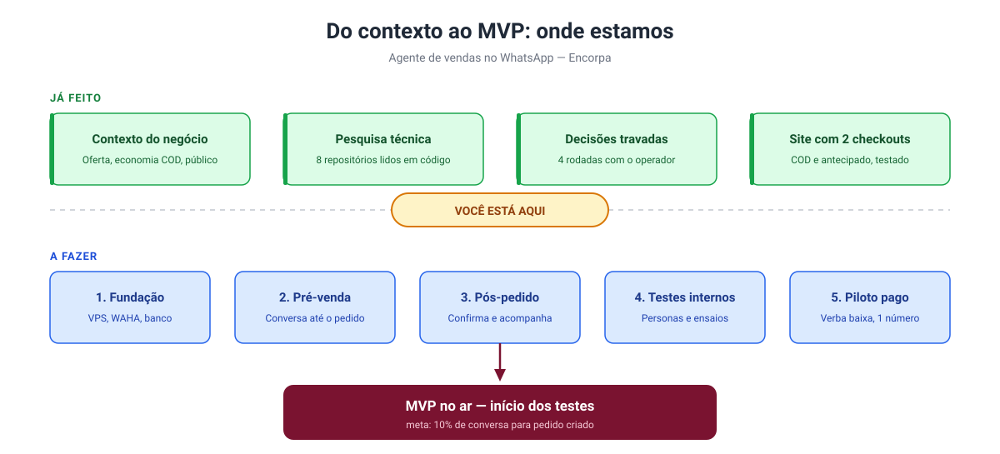
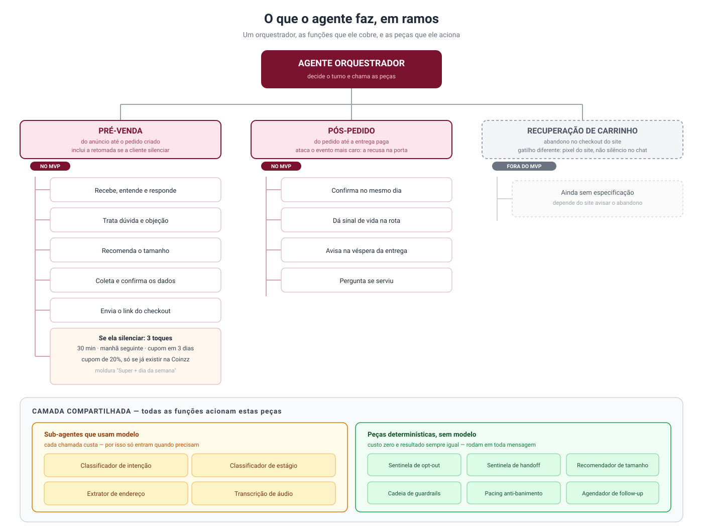

# Plano de construção — do MVP ao início dos testes

> **Status deste documento:** plano de execução, não decisão de negócio nova.
> Tudo aqui deriva do que já está registrado em [`../../documentacao/contexto-negocio/`](../../documentacao/contexto-negocio/),
> [`../02-especificacao/`](../02-especificacao/), [`../03-pesquisa/`](../03-pesquisa/) e
> [`../../documentacao/decisoes/03-decisoes-tomadas.md`](../../documentacao/decisoes/03-decisoes-tomadas.md).
> Onde este plano precisa de algo que ainda não foi decidido, isso está marcado como
> **pergunta aberta**, não como suposição.

## Como ler este documento

1. [**Onde estamos**](#1-onde-estamos) — o que já existe, em uma imagem
2. [**O que o agente vai fazer**](#2-o-que-o-agente-vai-fazer) — a árvore de funções e peças
3. [**As ondas de construção**](#3-as-ondas-de-construção) — o trabalho, em ordem, em duas fases
4. [**Perguntas que preciso te fazer**](#4-perguntas-que-preciso-te-fazer-antes-de-cada-onda) — por onda, para você responder quando chegar a vez
5. [**Critério de saída do MVP**](#5-critério-de-saída-do-mvp) — como saber que terminou
6. [**Riscos**](#6-riscos-que-o-plano-não-resolve-sozinho)
7. [**Quanto tempo isso leva**](#7-quanto-tempo-isso-leva) — a estimativa em sessões

---

## 1. Onde estamos

**Já feito** (documentação e decisão, zero código do agente):

- Contexto completo do negócio: oferta, economia do COD, público, os dois caminhos de venda
- Pesquisa em 8 repositórios open source, lida em código, com padrões extraídos por necessidade
- Quatro rodadas de decisão de negócio com o operador, e uma quinta de infraestrutura — praticamente todas as perguntas de negócio resolvidas
- O site (Encorpa-Website) já tem as duas formas de pagamento no seletor de todo ponto de compra, testadas por personas no navegador, e mergeadas
- A pilha está fixada (rodada 5): Supabase como banco, n8n como orquestração, PikaPods para o que precisa ficar de pé, WAHA como transporte, [Hermes Agent](https://github.com/NousResearch/hermes-agent) como otimizador

**Ainda não existe:** nenhuma linha de código do agente. Nenhum banco de dados criado.
Nenhum número de WhatsApp. É o que este plano cobre — e, desde a rodada 5, ele cobre isso
**sem depender do número para começar** (§R5.1).

---

## 2. O que o agente vai fazer

Um único **orquestrador** decide o que fazer a cada turno de conversa. Ele aciona três funções — na ordem de prioridade já decidida ([`03-decisoes-tomadas.md`](../../documentacao/decisoes/03-decisoes-tomadas.md) §Q5) — e duas camadas de apoio, compartilhadas pelas três.

### As três funções (o que a cliente sente)

| # | Função | Cobre |
|---|---|---|
| 1 | **Pré-venda** | Do clique no anúncio até o pedido criado — a conversa que vende |
| 2 | **Pós-pedido** | Confirmação no mesmo dia, sinal de vida na rota, aviso na véspera, pergunta pós-entrega |
| 3 | **Recuperação** | Três toques para quem parou de responder, com cupom de 20% no terceiro |

A recuperação de carrinho abandonado **no site** (função 2 da lista original do operador) fica fora do caminho crítico deste plano — depende de o site avisar o agente, o que ainda não existe.

### A camada compartilhada (como ele decide)

**Sub-agentes que usam modelo de linguagem** — cada chamada custa dinheiro, então só entram quando precisam: classificador de intenção, classificador de estágio do funil, extrator de endereço a partir de texto livre, transcrição de áudio.

**Peças determinísticas, sem modelo** — rodam em toda mensagem, custo zero: sentinela de opt-out (dois níveis, ver [`04-guardrails.md`](../02-especificacao/04-guardrails.md)), sentinela de pedido de humano, recomendador de tamanho (tabela + regra do maior), a cadeia de 11 guardrails antes de qualquer envio, pacing anti-banimento, agendador de follow-up.

Essa divisão não é estética: é a decisão de arquitetura mais repetida na pesquisa (`03-pesquisa/03-extracao-por-necessidade.md` §N3, N4) — o que pode ser regra determinística nunca deveria custar uma chamada de modelo.

---

## 3. As ondas de construção

> **Reordenadas na rodada 5** ([`../../documentacao/decisoes/03-decisoes-tomadas.md`](../../documentacao/decisoes/03-decisoes-tomadas.md)
> §R5.1). O plano antigo abria provisionando VPS e pareando o número — hoje isso não pode
> nem começar: não existe número, e nada se contrata antes de o gratuito acabar. As ondas
> agora estão em duas fases, separadas por aquilo que a fase exige do mundo real.

**Fase A — sem canal e sem gasto.** Tudo que não precisa de WhatsApp nem de cartão. É a
maior parte do sistema, e termina com o agente inteiro funcionando contra um canal simulado.

**Fase B — com canal e com gasto.** O que só existe depois do número e da primeira conta:
plugar o WAHA, testes internos reais, piloto pago.

O que torna a fase A possível é o **contrato de canal**: um adapter com o formato de entrada
e o endpoint de saída do WAHA, e um canal simulado que fala esse mesmo contrato. Trocar o
simulado pelo real é troca de adapter, não reescrita — o mesmo padrão das personas de
navegador que já validaram o site.

---

### Fase A — sem canal e sem gasto

#### Onda A0 — Fundação

| Item | Decisão | Trabalho desta onda |
|---|---|---|
| Banco | Supabase (§R5.2) | Organização nova (a atual já está no limite de 2 projetos do plano free), projeto, schema e migrações: leads, conversas, mensagens, pedidos, follow-ups, chamadas de modelo com custo, traces de guardrail |
| Fila | Tabela SQL, sem Redis (`01-lacunas.md` #10) | `enqueue`/`claim`/`complete` em Postgres |
| Cérebro do turno | Código versionado (§R5.6) | Esqueleto do serviço: config, seam único de chamada de modelo com teto de custo e trace (§H6, §H7) |
| Contrato de canal | Novo (§R5.1) | Formato de entrada e saída, adapter simulado, adapter WAHA (escrito agora, ligado na fase B) |

**Critério de saída:** uma mensagem entregue ao canal simulado vira linha no Supabase, e uma
resposta escrita à mão no banco sai pelo canal simulado. Sem inteligência nenhuma — o cano.

#### Onda A1 — O que não custa chamada de modelo

Tudo que é determinístico, com teste automatizado, antes de qualquer prompt existir.

| Peça | Onde está especificada |
|---|---|
| Máquina de estados | `02-especificacao/03-maquina-de-estados.md` |
| Cadeia de 11 guardrails antes do envio | `02-especificacao/04-guardrails.md` |
| Sentinela de opt-out (dois níveis) e de pedido de humano | `04-guardrails.md` |
| Recomendador de tamanho (tabela + regra do maior) | `01-conhecimento/02-tabela-de-medidas.md` |
| Matcher da base de conhecimento | `01-conhecimento/01-base-de-conhecimento.md`, §C4 |
| Variantes de re-entrada por `hash(lead_id) % n` | `01-mapa-funcional.md` §F4 |
| Ritmo humano: atraso por bolha, "digitando" reenviado em blocos | §B7 |

**Critério de saída:** suíte de testes verde cobrindo cada guardrail e cada transição de
estado. Nenhuma chamada de modelo envolvida — custo zero, inclusive em CI.

#### Onda A2 — A conversa

| Peça | Onde está especificada |
|---|---|
| Debounce de mensagens picadas | §B2 |
| Classificação de intenção | §B4 |
| Montagem de contexto e prefixo cacheável | §B5, §H8 |
| Resposta só por tool `send_message` | §B6 |
| Coleta de nome e endereço, com confirmação repetida | §D1, §D2 |
| Modalidade de pagamento, com as duas metades obrigatórias da frase | §D3 |
| Caminho de exceção do COD indisponível na região | §D3, §Q8, §Q14 |

Aqui entram as primeiras chamadas de modelo — na camada gratuita de algum provedor (§R5.8),
não na de produção.

**Critério de saída:** uma persona automatizada conversa do "oi" até os dados completos,
sem violar guardrail e sem estourar o teto de custo.

#### Onda A3 — Pedido, régua de silêncio e pós-pedido

| Peça | Onde está especificada |
|---|---|
| Checkout pré-preenchido da Coinzz | §E1, §R3.1, §R4.1 |
| Registro do pedido com idempotência | §E2 |
| Régua de silêncio: 3 toques, cupom de 20% no terceiro | §F1–F4, §Q9, §R4.3 |
| Gate de cupom inexistente | `04-guardrails.md` |
| Régua de pós-pedido: confirmação, sinal de vida, véspera, pós-entrega | §G1–G4 |
| Handoff humano | §Q12 |

**Sem credencial da Coinzz, o checkout entra como mock com teste de contrato** — o formato
fica escrito e testado, e a troca pelo real é uma configuração. É a pergunta 4 da seção 4.

**Critério de saída:** relógio simulado; uma conversa que silencia recebe os três toques nos
tempos certos, e um pedido de teste recebe as quatro mensagens da régua.

#### Onda A4 — Cano, relógio e otimizador

| Peça | Onde |
|---|---|
| Fluxos do n8n: entrada, crons de varredura, webhook da Coinzz, notificação de handoff, ping do banco | §R5.3 |
| Views de métrica para o Hermes | §R5.7 |
| Relatório periódico e formato de proposta do Hermes | §R5.7 |
| Conversão de volta para o Meta com `ctwa_clid` | §A3 |

**Critério de saída:** a rodada completa de personas passa ponta a ponta com o n8n no meio,
e o Hermes produz uma proposta de mudança legível — sem publicar nada sozinho.

---

### Fase B — com canal e com gasto

#### Onda B0 — Ligar o canal

Pod no PikaPods, WAHA de pé, número pareado, adapter real no lugar do simulado. **O número
precisa ser adquirido e aquecido antes**, e isso é prazo de calendário, não trabalho de
sessão — ver a pergunta 15 da seção 4.

**Critério de saída:** uma mensagem real ao número novo recebe a resposta real, com o mesmo
comportamento que as personas já validaram.

#### Onda B1 — Testes internos

Time interno conversando de verdade com o agente, sem tráfego pago. As personas automatizadas
pegam erro estrutural; gente pega o que soa errado.

#### Onda B2 — Piloto pago

Fração pequena da verba, medindo CPL e conversão contra o [modelo econômico](../../documentacao/contexto-negocio/06-modelo-economico.md).

### Fora das ondas: o que fica para depois do MVP

Sem mudança em relação ao plano original — recuperação de carrinho **do site** e
recompra/reengajamento de longo prazo seguem como prioridade 3 e 4 (§Q5), fora do caminho
crítico. Ver perguntas 13 e 14.

---

## 4. Perguntas que preciso te fazer antes de cada onda

Nem tudo foi decidido nas quatro rodadas anteriores. O que falta está listado aqui, amarrado à onda em que vai fazer falta — não precisa responder tudo agora, só antes de a onda correspondente começar.

### Antes da onda A0 (fundação)

1. ~~**Runtime do agente.**~~ ✅ Resolvida na rodada 5 (§R5.3, §R5.6): n8n como orquestração e integrações, cérebro do turno em código versionado.
2. **Provedor de modelo.** Duas respostas, e só a primeira bloqueia alguma coisa agora: (a) **qual camada gratuita usamos para desenvolver** — você já tem conta Google/Gemini ligada ao n8n, serve? (b) qual modelo redige a conversa em produção fica para o piloto, quando o custo vira número medido (§R5.8).
3. ~~**Acesso à VPS.**~~ ✅ Não bloqueia mais: infraestrutura só entra na fase B (§R5.4). Quando entrar, decidimos se você provisiona o PikaPods com eu acompanhando ou se me dá acesso.

### Antes das ondas A2 e A3 (conversa, pedido, réguas)

4. **Confirmação técnica da API da Coinzz.** Você confirmou que existe integração via API (`03-decisoes-tomadas.md` §R4.1). Preciso das credenciais e da documentação de endpoint para implementar `build_prefilled_checkout_link` de verdade, não como mock.
5. **Botões vs. texto livre.** Você decidiu texto livre sempre (`03-decisoes-tomadas.md` §R2.4). Isso está fechado — só cito aqui porque é a onda em que passa a valer.
6. **O cupom de 20%.** Você disse que vai criar (`03-decisoes-tomadas.md` §R2.7). Preciso do código antes de a régua de silêncio poder ser testada de ponta a ponta — sem ele, o teste para no gate que impede a agente de mencionar cupom inexistente, o que é o comportamento certo, mas não deixa testar o toque 3 inteiro.
7. **Canal de notificação do handoff.** "Para e notifica" (`03-decisoes-tomadas.md` §Q12) — notifica onde? WhatsApp pessoal seu, e-mail, um número interno? Preciso do destino real antes de implementar o alerta.
8. **Teto de custo por conversa.** Ficou decidido que existe um teto (`03-decisoes-tomadas.md` §Q11), mas não o valor em reais. Sugestão minha, a confirmar: **R$ 0,80**, o mesmo número que o [modelo econômico](../../documentacao/contexto-negocio/06-modelo-economico.md) usa como premissa de custo médio **por lead** — aqui eu o reaproveito como teto rígido por conversa individual, não como média, e "lead" e "conversa" são o mesmo evento neste funil. Concorda, ou prefere outro valor?

### Antes da onda A3 (pós-pedido)

9. **Webhook da Coinzz.** Preciso do formato exato do payload que a Coinzz manda (nome dos campos de status, ex.: `pedido_criado`, `saiu_para_entrega`) para desenhar o parser. Você tem acesso a um exemplo de payload, ou preciso pedir isso ao suporte deles?
10. **Integração com a Logzz para status de entrega.** O aviso de véspera depende de saber a data prevista. Isso vem pela própria Coinzz (que já integra Logzz), ou preciso de uma chamada separada à Logzz?

### Antes da onda B1 (testes internos)

11. **Quem faz os testes internos.** Você mesmo, alguém da sua equipe, ou peço para eu simular com um script (como fiz no site, com personas automatizadas)? Provavelmente as duas coisas se complementam — automatizado pega erro estrutural, humano pega o que soa errado.

### Antes da onda B2 (piloto pago)

12. **Orçamento do piloto.** O modelo econômico assume R$ 300/dia de mídia nos três cenários. Para o piloto inicial, você já tem um valor menor em mente, ou começamos com uma fração disso a definir juntos quando chegar a hora?

### Sem onda fixa — decide quando você quiser antecipar ou não

15. **O número de WhatsApp — quando você compra o chip?** Esta é a única pergunta com prazo de calendário embutido, e por isso é a mais urgente da lista mesmo estando na fase B. Número novo que começa a conversar em volume é o cenário clássico de banimento: ele precisa de semanas de uso normal antes de receber tráfego pago. Comprar o chip e usá-lo como número comum enquanto a fase A é construída é a forma mais barata de comprar tempo — não custa quase nada e não depende de nenhuma decisão técnica.

16. **Canal de notificação do handoff, sem WhatsApp.** A decisão (§Q12) é "para e notifica" — mas notifica onde, enquanto não existe número? E-mail, Telegram, um webhook que cai no seu n8n? Precisa de um destino real para o alerta ser testável na fase A.

17. **Onde o Hermes roda e com que frequência.** Pod próprio no PikaPods, sua máquina, ou dentro do n8n por cron? E de quanto em quanto tempo ele revisa as conversas — semanal, a cada N pedidos? A governança já está decidida (§R5.7: propõe, não publica); falta o lugar e o relógio.

18. **Token do Meta para a conversão de volta (§A3).** Sem ele, a campanha otimiza por "conversa iniciada" em vez de pedido criado — o mesmo erro de medir a etapa errada que o projeto já identificou. É gratuito, só depende de acesso ao Business Manager.

19. **Quem grava os áudios** de boas-vindas e explicação do produto (§R3.5). Não bloqueia nada na fase A, mas leva tempo humano e costuma ser esquecido até a véspera.

20. **Retenção de dado pessoal.** O banco vai guardar telefone e endereço. Por quanto tempo, e o que acontece quando alguém pede para sair (o opt-out já existe como guardrail, mas apagar dado é outra coisa)? Decisão sua, não minha.

13. **Recuperação de carrinho do site — antecipar ou deixar para depois do MVP?** Não tem especificação nenhuma ainda no projeto: depende de um evento que o site hoje não emite (abandono de checkout). O `colet/src/lib/pixel.ts` já dispara `InitiateCheckout`, então dá para construir em cima disso — mas preciso da sua confirmação de que essa é a fonte certa, e de saber se você quer isso dentro do MVP ou como próxima onda depois dele. A própria ordem que você definiu (Q5) coloca isso como prioridade 3, abaixo de pré-venda e pós-pedido — meu plano segue essa ordem à risca, mas se você preferir adiantar, me avise.
14. **O item "Follow-up" da ordem do Q5.** Registrei minha leitura de que ele se refere a recompra e reengajamento de longo prazo (`01-mapa-funcional.md` §G6), separado da régua de silêncio (que já é parte da onda A3). Confirma essa leitura, ou você quis dizer outra coisa com esse item?

---

## 5. Critério de saída do MVP

O MVP está pronto para começar os testes reais (fim da onda B1, começo da B2) quando,
**todos ao mesmo tempo**:

1. Uma mensagem para o número novo do WhatsApp recebe resposta dentro do ritmo definido (mensagem automática instantânea + resposta real em 3 minutos ou às 06:00).
2. Uma conversa completa — do "oi" ao link de checkout — funciona sem intervenção humana, para pelo menos os três casos centrais: cliente decidida, cliente com dúvida de tamanho, cliente com objeção de golpe.
3. Uma conversa que silencia recebe os três toques de retomada no tempo certo, com o cupom só mencionado se já existir na Coinzz.
4. Um caso forçado de fora de escopo escala para humano em vez de inventar resposta, e o teto de custo por conversa é respeitado.
5. Um pedido de teste recebe a régua completa de pós-venda (confirmação, sinal de vida, véspera, pós-entrega) nos momentos certos.
6. Pelo menos três das personas de teste (onda B1) rodam limpo, sem violar nenhum guardrail.
7. Todas as perguntas da seção 4 marcadas como necessárias **até a onda em curso** estão respondidas — não é preciso ter as da onda B2 resolvidas para começar a A0.

**Fora do critério de saída do MVP, de propósito:** recuperação de carrinho do site e
recompra/reengajamento de longo prazo (pergunta 13 e 14) — são prioridade 3 e 4 na sua
própria ordem (Q5), abaixo das duas funções que definem este MVP.

Depois do critério acima: piloto com verba baixa (onda B2), medindo contra os cenários do
[modelo econômico](../../documentacao/contexto-negocio/06-modelo-economico.md), com a meta declarada de **10% de
conversa para pedido criado** como o piso, não o teto.

---

## 6. Riscos que o plano não resolve sozinho

Registrados para não serem esquecidos, não para serem resolvidos aqui:

- **Banimento do número.** É por isso que o pacing entra na onda A1, junto com o resto do determinístico, e não como refinamento depois de o canal existir. E é por isso que o número precisa ser adquirido e aquecido antes da onda B0 — ver pergunta 15.
- **Custo de IA fugir do controle.** É por isso que o teto de custo entra já na onda A0, no mesmo seam por onde toda chamada de modelo passa, antes de existir a primeira conversa.
- **A API da Coinzz não ser exatamente como esperado.** Ainda não foi testada de verdade — é a primeira coisa a verificar tecnicamente quando a credencial existir, e o plano tem um caminho alternativo já registrado (`03-decisoes-tomadas.md` §R3.1) caso o formato programático não funcione como o esperado.
- **Recusa na porta continuar acontecendo mesmo com a régua de pós-venda.** É risco de negócio, não de construção — só o piloto real mede isso.

---

## 7. Quanto tempo isso leva

Contado em **sessões de Claude Code**, não em horas: uma sessão é uma conversa de trabalho
que termina com algo verificável commitado. A conversão para dias depende só de quantas
sessões você abre por dia.

| Fase | Onda | Sessões |
|---|---|---|
| A | A0 — fundação: Supabase, fila, seam de modelo, contrato de canal | 2–3 |
| A | A1 — determinístico: estados, 11 guardrails, tamanho, matcher, ritmo | 3–4 |
| A | A2 — a conversa: debounce, intenção, contexto, coleta, pagamento | 3–4 |
| A | A3 — pedido, régua de silêncio, pós-pedido, handoff | 3–4 |
| A | A4 — n8n, métricas, Hermes, conversão para o Meta | 2–3 |
| **A** | **Total até o agente rodar contra canal simulado** | **13–18** |
| B | B0 — WAHA no pod, número pareado, adapter real | 1–2 |
| B | B1 — testes internos com gente | 2–3 |
| B | B2 — piloto pago e ajuste | 2–4 |
| **B** | **Total até o fim do piloto** | **5–9** |

**O que empurra para o topo da faixa:** resposta demorada às perguntas da seção 4 (cada uma
que falta vira mock a refazer depois), a API da Coinzz não se comportar como o esperado
(risco já registrado na seção 6), e retrabalho de copy — a conversa é o produto, e texto
costuma ir e voltar mais que código.

**O que empurra para o piso:** as decisões de negócio já estarem todas tomadas (estão), a
especificação já existir em detalhe (existe), e a fase A inteira ser testável sem esperar
nada de terceiro.

**O que esta estimativa não cobre:** o aquecimento do número (semanas de calendário, zero
sessões — ver pergunta 15) e o tempo de análise entre uma rodada de piloto e a seguinte.
