# Grafo de decisões — kits, checkout e o loop de verificação (2026-09-25)

Para não repetir erro: cada problema do dia, o caminho que **não** funcionou e por quê, a
correção que ficou e a guarda que impede a volta. Decisões de negócio em
[`03-decisoes-tomadas.md` §Rodada 14](03-decisoes-tomadas.md); detalhe técnico em
[`registro.md` M-09](../../agente-ia/08-mudancas/registro.md). Cada "guarda" é um teste e
uma mutação em `pnpm verificar:guardas` (o bug reinstalado tem de deixar o teste vermelho).

Legenda: 🟥 sintoma · 🟧 tentativa que falhou · 🟩 correção que ficou · 🛡️ guarda.

## Como ler antes de mexer

1. Vai mexer num **gate de preço ou prazo**? Leia os grafos 1, 2 e 8 — todos os atalhos
   óbvios já foram tentados e abriram mentira ou vetaram frase honesta.
2. Vai mexer em **estado da conversa** (kit, caminho, retry)? Grafos 3, 4 e 5.
3. Vai mexer em **handoff, despedida ou pós-venda**? Grafos 6 e 7.
4. As **lições** no fim valem para qualquer heurística de texto.

---

## 1. De quantas peças fala um preço?

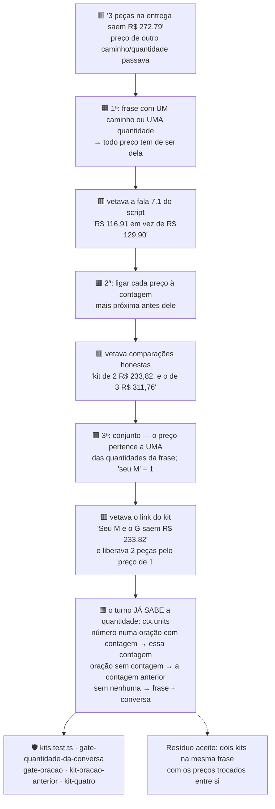

**Por que o conserto definitivo foi sair do texto:** três tentativas adivinhavam a
quantidade pelas palavras, e cada uma quebrou num formato novo. O turno determina a
quantidade de forma determinística (`quantityOf` + `leads.units`); o gate passou a
recebê-la em vez de inferir.

## 2. O preço de comparação ("em vez de R$ 129,90")

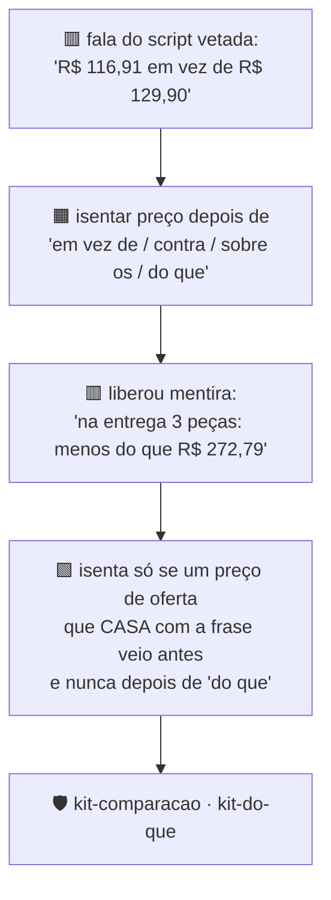

## 3. Qual caminho ela escolheu?

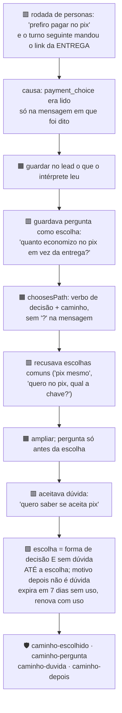

**Efeito colateral que o loop pegou:** guardar o caminho deixou conversas no antecipado
por mais tempo, e isso expôs o grafo 8 (prazo da entrega lido como prazo do antecipado).

## 4. Quando o kit é esquecido?

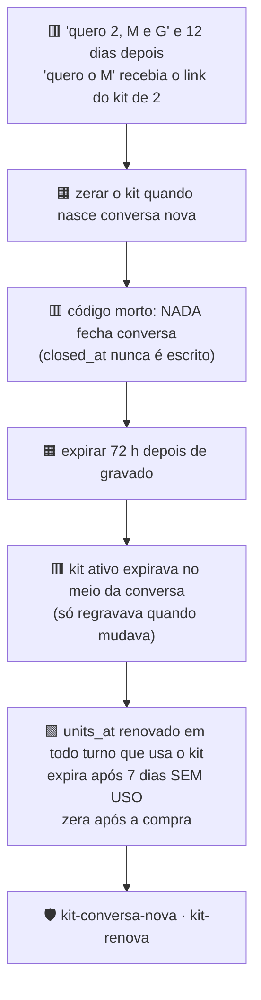

## 5. A nova tentativa (retry) duplica tamanhos?

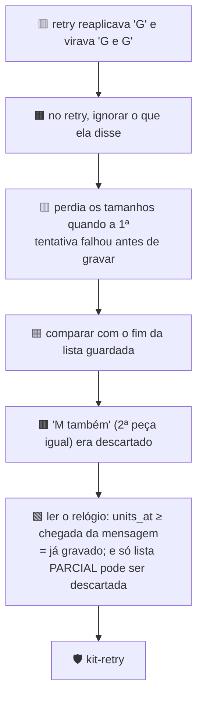

## 6. Pós-venda: quando passar para uma pessoa?

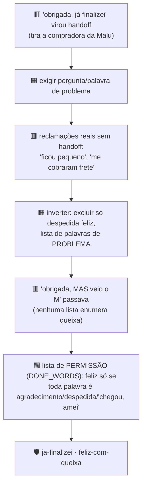

## 7. Despedida depois do link

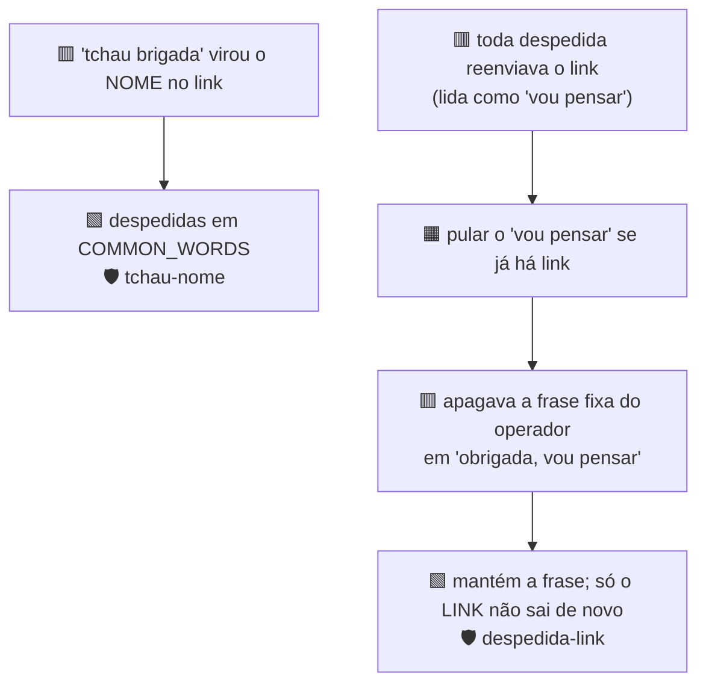

## 8. Prazo: de qual caminho é o número?

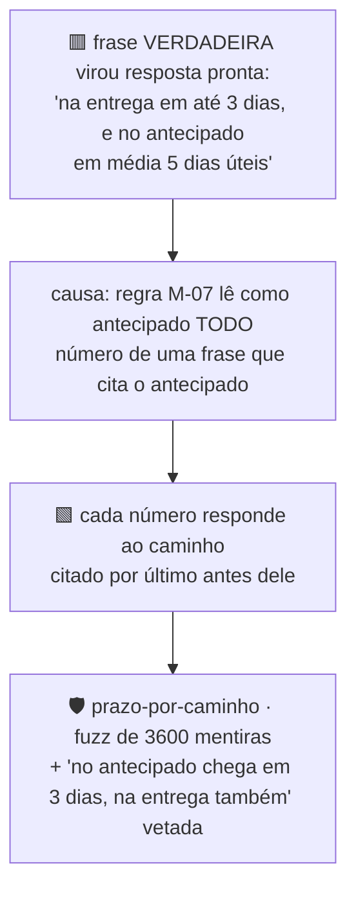

## 9. Peça grátis sem número

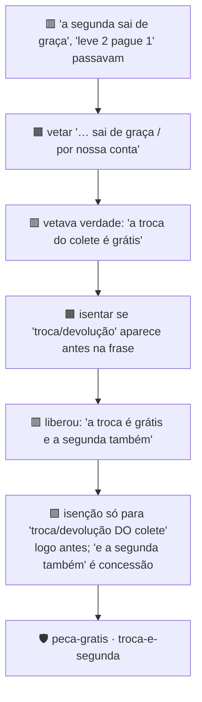

## 10. Régua pós-compra num kit

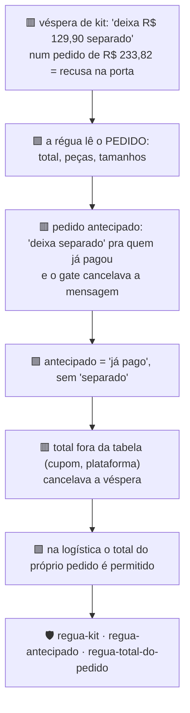

## 11. Checkout e integrações

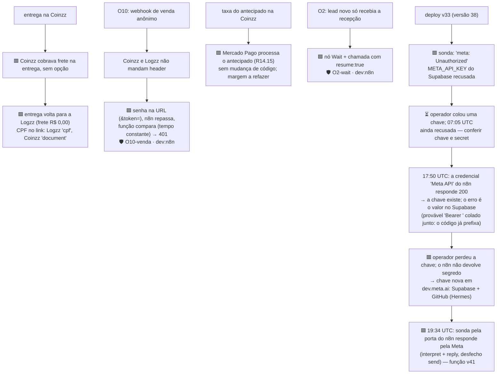

## 12. Quando o link sai? (H-2)

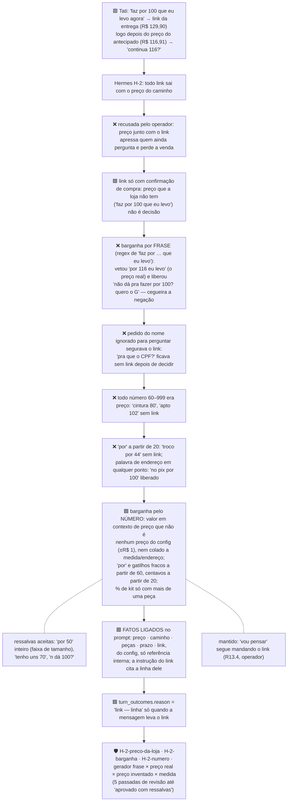

## 13. Ligar o WhatsApp sem abrir uma porta (R14.16)

```mermaid
flowchart TD
  S["Canal oficial precisa entrar antes do número existir"]
  G1["🟥 deliveryFor testado mas NÃO ligado à varredura:<br/>régua mandaria texto livre fora das 24h"]
  C1["🟩 varredura decide texto, template ou bloqueado (WA-1)"]
  R1["🟥 revisão: encorpa-inbound e a função turn são portas públicas<br/>(chave anon abre a função; o n8n repassava o corpo inteiro)"]
  C2["🟩 selo da entrada (HMAC) + lista fechada no n8n<br/>+ TURN_REQUIRE_SERVICE_ROLE"]
  R2["🟥 revisão: last_inbound_at gravado no fim do turno,<br/>na retomada e na nova tentativa: janela esticada"]
  C3["🟩 gravado uma vez, na mensagem dela, com o horário da Meta;<br/>janela fecha 10 min antes"]
  R3["🟥 revisão: mensagem perdida depois do 200 sem rastro;<br/>toque bloqueado cancelado em silêncio"]
  C4["🟩 envio em paralelo com log por id; e-mail dos toques bloqueados"]
  R4["🟥 2ª revisão: n8n enviava pelo campo channel, que o chamador escreve;<br/>recibo de leitura disparava em qualquer POST; 401 de selo virava e-mail"]
  C5["🟩 turno devolve sealed; n8n só envia com ele;<br/>recibo sai da função whatsapp (assinatura da Meta conferida)"]
  OFF["🟩 envio desligado (CANAL_ATIVO=false) até os valores do sócio"]
  GD["🛡️ WA-1-janela · WA-selo · WA-janela-no-fim · WA-envio-desligado · WA-canal-forjado ·<br/>regras n8n (corpo inteiro, channel, sealed) · teste do nó de envio contra src/channel"]
  S --> G1 --> C1 --> R1 --> C2 --> R2 --> C3 --> R3 --> C4 --> R4 --> C5 --> OFF --> GD
```

## 14. Margem do antecipado com o Mercado Pago (R14.15)

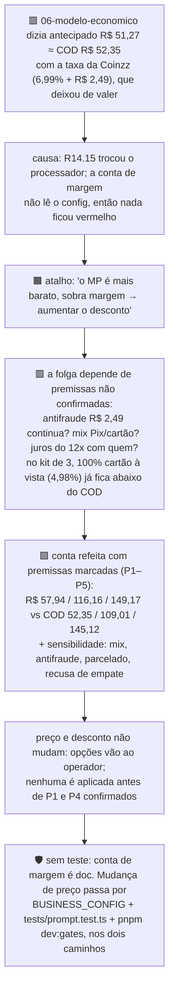

**Fechado em 2026-09-26:** P1 confirmado (antifraude não é cobrado) e o operador manteve
preços e descontos.

**Resíduo:** o número vale enquanto P4 (parcelado) não for confirmado
no painel do Mercado Pago/Coinzz. Trocou taxa, processador ou mix, refaça a tabela da caixa
de 2026-09-25 em [`06-modelo-economico.md`](../contexto-negocio/06-modelo-economico.md).

## 15. `perdido` sem dono (plano v2, 7.4)

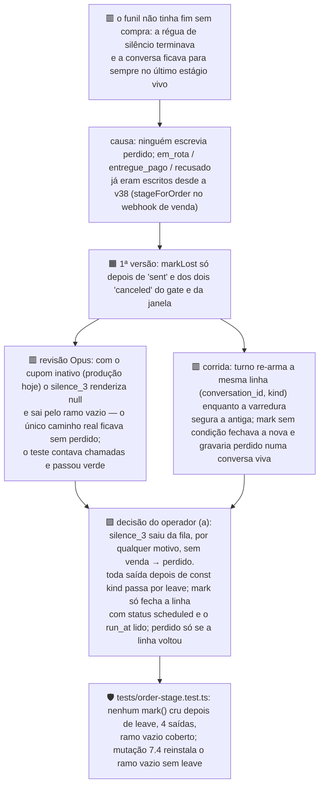

Ela volta sozinha: `furthest(perdido, x)` devolve o estágio que o próximo turno alcança.
Opt-out e handoff saem antes e não marcam; toque adiado não saiu da fila.

**Limites conhecidos:**
- **Venda que o webhook não casou** (`unknown_lead`, `ambiguous_phone`) deixa a régua viva.
  Três dias depois a conversa vira `perdido` sobre uma compra real. Isso se corrige sozinho
  se o webhook chegar depois (`furthest(perdido, pedido_criado)`).
- **Envio depois da resposta dela:** fechado em 2026-09-26, na segunda revisão. O toque só
  é gravado e enviado depois que a varredura fecha a linha. Se a cliente respondeu no
  intervalo, a linha já foi reagendada pelo turno dela e o toque velho não sai. A nova
  tentativa de turno segue a mesma regra. O custo é que o envio passa a ser no máximo uma
  vez: uma falha depois de fechar a linha perde um toque, em vez de enviar dois.
- **Sem conversa sintética:** não há conversa sintética de ponta a ponta; o teste lê a
  estrutura da varredura, que roda só no Deno.

## 16. Dois pedidos no mesmo lead

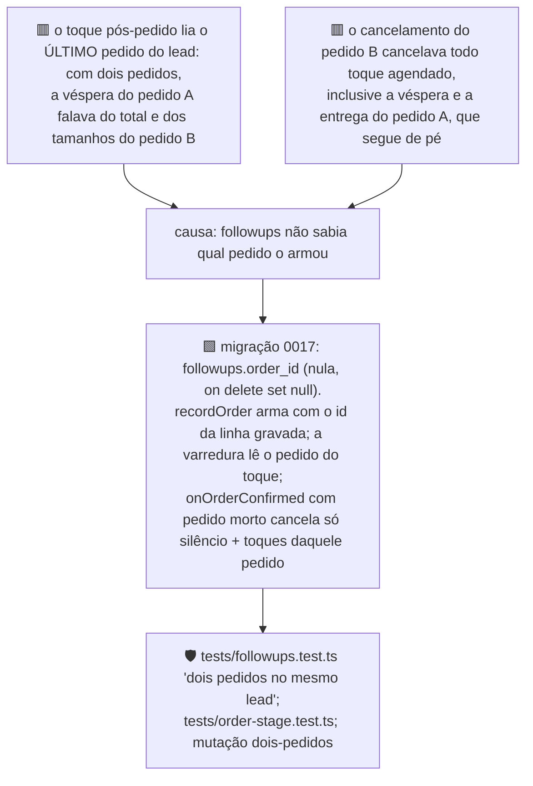

**Ordem de deploy:** aplicar a 0017 **antes** de publicar a `turn`. A varredura seleciona
`order_id`, e sem a coluna o PostgREST recusa a leitura: nenhum toque sai.

**Limites conhecidos:**
- **O segundo pedido não ganha régua própria**, porque `unique (conversation_id, kind)` já
  está ocupado pelos toques do primeiro. Mudar isso é mudar a chave da tabela, e fica fora
  deste passo.
- **Estágio por lead (revisão Opus, corrigido no mesmo dia):** o cancelamento do pedido B
  gravava `recusado`, que é terminal, enquanto o pedido A estava em rota. Quando A era
  entregue, a venda continuava contando como recusa. Agora `stageForLead` só grava
  `recusado` se nenhum outro pedido do lead estiver vivo. Continua em aberto o caso de
  ordem inversa: um pedido A recusado sozinho e, depois, um pedido B novo e entregue. A
  conversa fica em `recusado`, porque o estágio terminal não reabre.
  "Vivo" quer dizer "não morto" (`isOrderDead`). Um Pix expirado ou parado em "aguardando
  pagamento" conta como vivo e impede o `recusado` de outro pedido. O erro vai para o lado
  seguro: um estágio não terminal. Incluir `expir` em `isOrderDead` quando o vocabulário real
  das plataformas for conhecido.
- **Linha armada antes da 0017** tem `order_id` nulo e segue a regra antiga: lê o último
  pedido e morre com qualquer pedido cancelado.

## 17. O lembrete de 15 minutos depois do link nunca foi agendado (§R10.4)

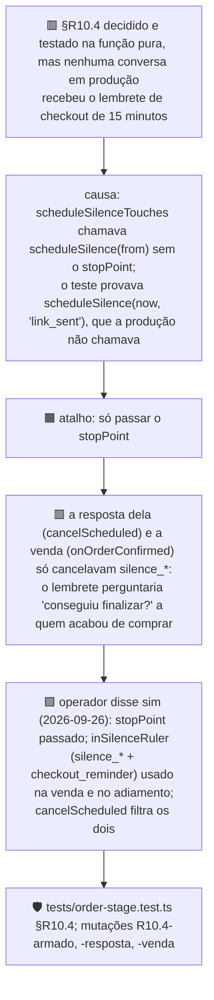

**Sexta revisão (NEEDS WORK, corrigida no mesmo dia):**
- **Lembrete duplicado:** com o link mandado às 23:40, o lembrete sai às 23:55. O
  `silence_1` era adiado para as 06:00 e reancorava a régua inteira, e o upsert reativava
  o lembrete que já tinha saído. Agora `rulerFor` só rearma o lembrete quando o toque
  adiado é o próprio lembrete, e o cancelamento do reancoramento não toca nele.
- **Lembrete de link que não saiu:** `stopPointOf` armava `link_sent` pela palavra
  "link" ou "checkout", que aparecem também em oferta e negação ("quer que eu te mande o
  link?"). Agora só conta se o texto leva um dos links de checkout, pela mesma função do
  M-03 (`linkSentRecently`), com os testes de negação. A sétima revisão pegou uma primeira
  versão com um segundo helper igual; a lista de links agora é montada uma vez só, em
  `CHECKOUT_BASES`.
- **Guardas:** mutações R10.4-duplicado e R10.4-palavra-link.

Achado pela revisão Opus de 2026-09-26 (terceira passada do §15), fora do diff que ela
revisava. **Lição:** um teste da função pura não prova que a produção chama a função com
esse argumento.

## 18. M-08: prazo do antecipado por extenso

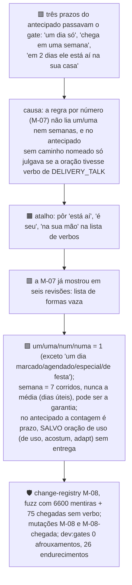

**Primeira revisão independente (NEEDS WORK, corrigida no mesmo dia):**
- **Faixa em semanas:** "1 a 2 semanas" escapava nos dois caminhos, porque o fim da faixa
  ia para uma checagem que só lia dias.
- **Âncora da garantia:** o backtracking em `(?:receb|cheg)\w*` derrotava o lookahead. Com
  isso, "tem uma semana pra trocar depois que chega em uma semana" era isentada como
  garantia.
- **Isenção de uso:** valia para a oração inteira, e "em 3 dias ele está aí pra você se
  adaptar" passava. Agora só isenta quando o uso governa a contagem.
- **Arrependimento:** "7 dias pra desistir, a contar do dia que receber" era vetada, e
  agora passa.
- **Guardas:** cada família tem gerador de fuzz, e há as mutações M-08-semanas, -ancora e
  -uso. Contra o `main`, 0 afrouxamentos.

**Segunda revisão (NEEDS WORK, corrigida no mesmo dia):**
- **Âncora com enchimento:** a âncora nova "a contar do dia que" e o `desist` abriram
  "tem 7 dias pra desistir quando chegar aí em 7 dias". O lookahead só protegia a contagem
  colada no verbo. Agora a âncora não sai quando o verbo dela tem uma contagem na mesma
  oração.
- **Troca ao lado de chegada sem verbo:** "pode trocar: em 7 dias ele está aí" passava
  (desde a M-07), e o "que é quando ele chega" era apagado como âncora. Agora os dois são
  barrados.
- **Guardas:** mutações M-08-enchimento, -troca-chegada e -que-e-quando. A M-08-ancora foi
  reescrita, porque a versão antiga deixou de reinstalar o bug.
- **Aceito em `gate-loosen-accepted.txt`:** "No pix você tem 7 dias pra desistir, a contar
  do dia que receber." É a frase honesta do arrependimento (CDC), e a base a vetava.

**Terceira revisão (NEEDS WORK, sem afrouxamento):** os consertos da segunda tinham sido
de sintoma, por lista de preposições, e os irmãos passavam: "em uns/cerca de/no prazo de 7
dias", "e em 7 dias ele está aí", "7 dias, bem quando ele chega". Agora a correção é pela
oração:
- **Contagem e âncora:** uma contagem na mesma oração do verbo da âncora é complemento
  dele, e a âncora fica. O único corte é "(você) tem/terá/são/é" logo antes da contagem.
- **Oração nova:** uma conjunção colada à contagem abre oração nova, e aí a troca não
  isenta mais.
- **Âncora depois da contagem:** só é retirada se estiver colada à contagem.
- **Dois-pontos:** ":" não abre oração quando vem seguido de "você tem".
- **Guardas:** 11 mutações da M-08.

**Quarta revisão (NEEDS WORK, sem afrouxamento) → ônus invertido:** depois de quatro
rodadas fechando formas enquanto os irmãos seguiam abertos, veio a mentira mais grave com o
pix nomeado: "o prazo até quando chegar é de 7 dias". O desenho foi invertido. A contagem
da garantia só é isenta quando uma forma de garantia a governa **positivamente**:
- **Propósito colado:** "7 dias pra trocar".
- **Palavra de troca tomando a contagem:** "a troca é em 7 dias", "pode trocar em até 7
  dias".
- **Depois da contagem, só o permitido:** "corridos/úteis", o propósito, uma âncora de
  início ou uma oração que não fala de chegada.

Saíram oito regexes (`anchor`, `anchorAfter`, `glued`, `newClause`…) e mais quatro variáveis
de apoio. **Lição:** numa isenção, liste o que prova a exceção, não o que a desmente.

**Quinta revisão (APROVADO COM RESSALVAS):** nenhuma mentira de chegada passa. As ressalvas
eram falsos positivos em frases honestas, e foram corrigidas no mesmo dia:
- **Falas do roteiro:** a fala para a objeção do antecipado ("7 dias pra trocar ou devolver
  contando do dia que receber", `02-script-do-agente.md:252`) era vetada. Agora passa.
- **Troca de tamanho:** "7 dias pra trocar de tamanho" era vetada. Agora passa.
- **Chegada por extenso:** "e ele está com você" e "o colete é seu" passaram a ser julgadas
  como chegada.
- **Aceitos:** as quatro frases do roteiro e da base que a base vetava.
- **Risco aceito:** depois de ";" só verbo de entrega e presença são julgados. É isso que
  deixa passar a frase inteira do roteiro, e "Pode trocar em 7 dias; que é o tempo da
  viagem." também passaria.

**Sexta revisão (NEEDS WORK, com afrouxamento real):** os dois caminhos novos da quinta
abriram brechas. O caso "são/o prazo é de N depois que recebermos" isentava prazo sem
palavra de troca: "No pix, são 7 dias depois que recebermos" passava nos dois caminhos. E o
texto depois de ";" não era julgado, então "No pix você tem 7 dias pra trocar; a entrega
também." passava. Os consertos:
- **Isenção sem troca:** só vale com "você tem/terá" e com ela recebendo
  (`receb(er|e|eu|a)`).
- **Depois de ";":** é julgado como o resto da frase. Só sai a locução do roteiro "do
  pedido até a entrega".
- **Guardas:** geradores de fuzz para os dois caminhos e mutações M-08-recebermos e
  M-08-ponto-e-virgula.
- **Aceito:** a fala inteira do roteiro (`:252`).
- **Fora da M-08, família da M-10:** "Pagou no pix? São 7 dias…" passa no caminho da
  entrega, porque o nome do caminho está na frase anterior.

**Sétima revisão (NEEDS WORK, com afrouxamento real):** a locução do roteiro "do pedido até
a entrega" era retirada em qualquer lugar, e com isso "No pix, você tem 7 dias pra trocar do
pedido até a entrega" passava nos dois caminhos. Os consertos:
- **Locução:** agora só sai com o sujeito do roteiro ("eu fico aqui… com você do pedido até
  a entrega").
- **"Prazo":** "o prazo pra trocar é de 7 dias" voltou a passar.
- **Presença:** "tá aqui com você" passou a ser vetada.
- **Guardas:** mutações M-08-locucao e M-08-prazo-de-troca. Ao todo, 16 mutações na M-08.

**Oitava revisão (NEEDS WORK, um achado):** tirar o `!prazo` fez "a troca é fácil, e o
prazo é 7 dias" voltar a passar, porque uma troca solta em outra oração tomava a contagem.
Os consertos:
- **Troca governando:** agora a troca só toma a contagem quando a governa ("o prazo pra
  trocar é de", "pra trocar, o prazo é de", "é só trocar: você tem").
- **Cópula:** o substantivo aceita no máximo uma cópula, então "garantia e são" não vira
  mais "garantia é são".
- **Guardas:** um gerador com 1568 mentiras e as mutações M-08-troca-solta e M-08-copula.

**Nona revisão → APROVADO COM RESSALVAS:** num corpus acumulado de 612 frases das nove
rodadas, rodado no `main` e no branch nos dois caminhos, sobrou uma família só: "se precisar
receber e trocar, são 7 dias". Ali o "se" atravessava a chegada. Foi corrigida com um gerador
e a mutação M-08-se-chegada.

Ressalvas aceitas:
- **Garantia como condição:** "se quiser garantia, são 7 dias" já passava no `main`.
- **Frase ambígua:** "o prazo com garantia de troca é de 7 dias".
- **Nome na frase anterior:** "Pagou no pix? São 7 dias…" passa no caminho da entrega. É a
  família da M-10.
- **Dois falsos positivos baratos no antecipado.**

**Lição das nove rodadas:** cada exceção aberta para uma frase honesta foi a porta da mentira
seguinte. O que convergiu foi governo positivo, verificado por um corpus acumulado de
mentiras rodado contra o `main` a cada passada.

**Custo aceito:** no antecipado, uma contagem sem caminho nomeado e fora de uma oração de
uso agora é julgada. "Sua festa é daqui a uma semana" é vetada e custa uma reescrita,
nunca uma mentira. Das frases do corpus que passaram a ser vetadas, a maioria já é barrada
por outro gate. As exceções são falsos positivos baratos, como "já faz 10 dias" na fala da
cliente.

## 19. M-10: prazo da entrega por extenso, e o caminho nomeado na frase anterior

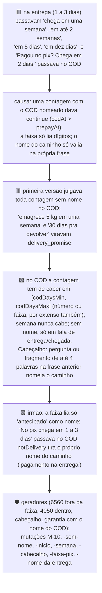

**Custo aceito:** falsos positivos baratos que custam uma reescrita cada. O mais provável é
"…7 dias pra trocar e suporte todo dia", porque a cauda da garantia recusa "dia".

**Revisão independente: APROVADO COM RESSALVAS.** Nenhuma mentira que o `main` vete passa no
branch. A negação no cabeçalho ("Sem pix, chega em 1 a 3 dias" vetada; "Nada de pix. Chega em
5 dias, depende da região" passando) foi corrigida em seguida.

A correção:
- **Negadores:** `prepaidNamed` ignora o nome do antecipado quando ele vem negado ("sem",
  "nada de", "não precisa", "não quer" fora de pergunta, "pix não!").
- **Onde vale:** no cabeçalho, na faixa e na regra de número.
- **Sombreamento:** o `PREPAY_NAME` local da faixa sombreava o externo, e com isso "Te mando
  o link e chega em 1 a 3 dias" era vetada. Foi consertado.
- **Guardas:** gerador com 802 frases e 5 mutações novas. Esta correção **não teve revisão
  independente**.

**Fora do conserto, já existiam antes e ficam registrados:**
- **Nome do COD depois da contagem:** "Chega em uma semana na entrega." passa no
  antecipado.
- **Cabeçalho COD com corpo de média:** "Na entrega? Varia, em média 5 dias úteis." passa.
- **"Entregador" ou "na porta" como nome do COD em frase do antecipado:** "No pix, o
  entregador leva em 2 dias." vai para a faixa de 1 a 3 dias.
- **Contagens fora da regra:** "um mês", "quinzena", "meia semana", "de zero a três dias",
  "às vezes cinco", "nunca passa de 5 dias", e "5 dias." sozinho.
- **Duas frases de caminho:** "Na entrega ou no pix, chega em 1 a 3 dias." passa no COD.

**Custo aceito, falsos positivos baratos no COD:** o `ARRIVAL` inclui "aí" (a muleta da
Malu) e casa "saia" em `sai\w*`. "E aí, em 2 semanas você já se acostuma" e "A garantia é de
7 dias pagando na porta" são vetadas.

**Instável, causa provável achada na revisão final de 2026-09-27:** `pnpm verificar:guardas`
deu 100, 101 e 102 de 102 no mesmo HEAD. A ferramenta lia a lista de mutações do arquivo da
árvore, mas aplicava cada mutação num worktree do commit. Com edição não commitada, as duas
versões divergiam. Além disso, uma guarda morta por timeout contava como "pegou".

A ferramenta agora:
- lê o HEAD uma vez só;
- recusa rodar com a árvore suja;
- trata guarda sem status como inconclusiva.

**Registro:** as mutações M-08-tomada e M-08-troca-solta tinham ficado com o texto de antes
da nona revisão, e foram atualizadas neste commit. Toda mudança numa linha âncora de mutação
tem de rodar `pnpm verificar:guardas` inteiro, não só a mutação nova.

## 20. Revisão final do branch (2026-09-27)

Quatro revisores Opus em paralelo (correção, integração, segurança, testes) sobre
`main...claude/focused-gates-fjpixt`.

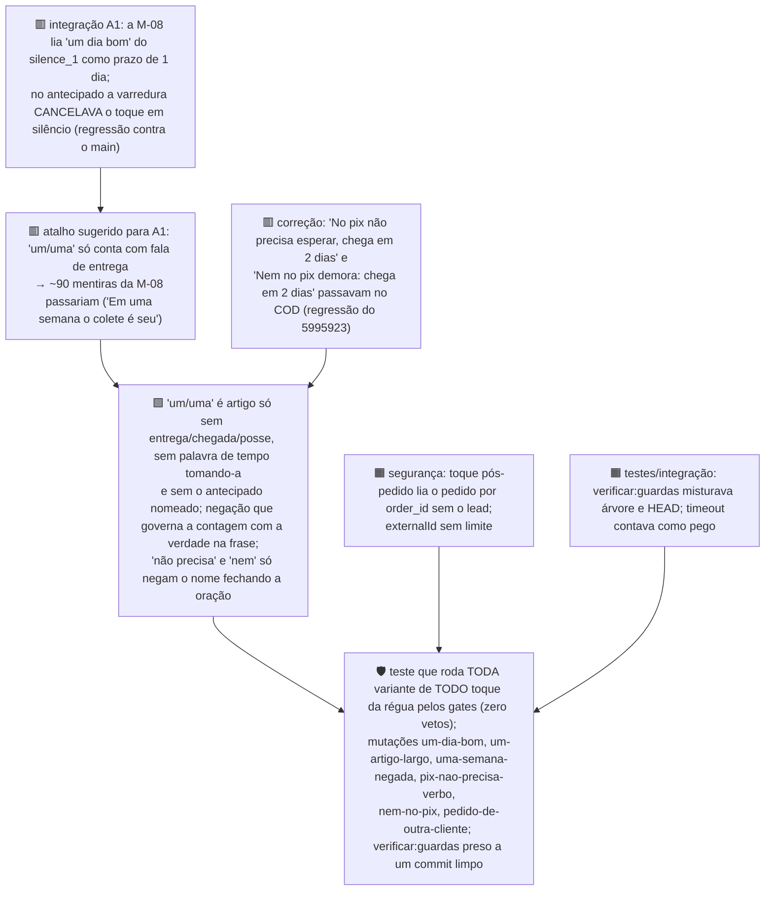

**Provado na PostgREST real, com leituras apenas:** `or=(kind.like.silence_*,kind.eq.checkout_reminder)`
casa, e a igualdade no timestamp que a própria API devolve (`…403606+00:00`) casa em `eq.`. Com
isso, o fechamento pela `run_at` e o cancelamento na resposta funcionam no banco de verdade.

**Aviso ao operador (corrigido em 2026-09-28):** o `perdido` não acontece de uma vez no
deploy. Produção tem 0 linhas em `followups`, e a v41 já cancela os `silence_3` vencidos. Com o
cupom inativo o `silence_3` sai cancelado, e isso é o fim da régua (opção a), um lead de cada vez.

**Resíduos:**
- **Mentira que passa no COD sem caminho nomeado:** "Uma semana e ele tá contigo". O `main`
  também deixava passar.
- **Negação só por extenso:** a negação que governa a contagem vale só para "um/uma".
- **Envio no máximo uma vez:** com o canal ligado, uma falha da Cloud API perde o toque. Fica
  só o e-mail de falha.
- **Testes só textuais:** vários testes de `index.ts` só leem o texto do arquivo. A prova de
  produção é a sonda da varredura pela porta do n8n depois do deploy.
- **Conferência final (APROVADO COM RESSALVAS):** a exceção do artigo deixa passar no
  antecipado mentiras de "uma semana" que o 5995923 vetava. O `main` também as deixava
  passar, então não é regressão. Os casos:
  - "Uma semana, no máximo." — o teste da cauda não aceita a vírgula; `^[\s,]+` resolve.
  - "Numa semana você já está com ele." — falta "com ele / o colete" na lista de posse.
  - "Daqui (a) uma semana você já está usando." — falta "daqui (a)" nas palavras de tempo
    antes da contagem.
  - "Numa semana você já veste." — chegada disfarçada de uso.

  A gravidade é baixa: uma semana corrida fica perto da média de 5 dias úteis. É o próximo
  item de gate.

## 21. Segunda revisão, por execução (2026-09-28): consertos fora do gate

A segunda revisão rodou o código da `turn` contra um PostgREST falso, com um harness de
execução fora do repositório, e foi cética com os commits anteriores. Estes são os achados
fora do gate, cada um reproduzido na base e corrigido com prova por execução (18/18):

| # | Sintoma | Conserto | Guarda |
|---|---|---|---|
| 1 | **Regressão:** o turno depois do link ("qualquer dúvida no checkout me chama") armava `before_size`, e ela ouvia "que tamanho você usa?" depois de comprar | `stopPointOf` lê a janela M-03 (as 3 últimas saídas e a resposta); o lembrete de 15 minutos só é armado no turno que traz o link (`linkInReply`) | R2-link-janela, R2-lembrete-so-no-link, R2-lembrete-turno |
| 2 | `silence_2` ou `silence_3` adiado rearmava os toques já enviados | reancorada, a régua recomeça do toque adiado (`ruler.slice(at)`) | R2-regua-recomeca |
| 3 | o adiamento sobrescrevia a régua que o turno dela acabara de armar | adiar exige reivindicar a linha (`status` + `run_at`) | R2-adiamento-posse |
| 4a | A e B criados, A cancelado: B ficava sem véspera | `orderTakeOver` passa os `order_*` não enviados ao pedido vivo | R2-dois-pedidos-vivo, R2-mesmo-pedido-nao-herda |
| 4b | depois de um pedido recusado, um pedido novo ficava em `recusado` | `reopensRefused`: reabre quando ESTE pedido está vivo e outro do lead está morto | R2-recusado-reabre |
| 5 | nova tentativa fora da janela virava handoff mesmo sem fechar a linha | handoff só com a linha fechada | R2-retry-janela-posse |
| 6 | `externalId` com surrogate isolado causava URIError depois do upsert | `isWellFormed()` antes de gravar, com recusa própria | R2-externalid-malformado |
| 7 | uma linha que lançava erro derrubava a varredura inteira | `sweepRow` isolada por linha; o erro vai para `skipped` | R2-varredura-isolada |

**Fica aberto:**
- **Webhook atrasado:** um webhook atrasado reescreve `orders.status`, e um "Enviado" que chega
  depois de um "Cancelado" faz o pedido parecer vivo.
- **Telefone malformado:** um telefone com surrogate isolado dá 500 antes de gravar qualquer
  coisa.
- **Tipo repetido na resposta:** a resposta de `recordOrder` lista o mesmo tipo em `canceled` e
  em `armed` quando o toque é passado ao pedido vivo.

## 22. O gate `delivery_promise` reestruturado (2026-09-28, decisão do operador: "unificar e consertar")

**Sintoma:** dez rodadas de revisão (M-08 e M-10) sem convergir. A auditoria adversarial da
segunda revisão, com cerca de 315 mil execuções, mostrou três coisas. O branch reduzia as
mentiras (de 112 mil para 39 mil), mas vetava frases honestas novas: recusar a data
impossível, garantia com média, reembolso e a fala do próprio prompt. E abria uma regressão:
"Sem pix, em 5 dias o colete é seu".

**Causa:**
- três listas diferentes para o nome do antecipado;
- quatro vocabulários de chegada;
- as regras de contagem e de faixa decidiam o caminho cada uma de um jeito.

Cada conserto remendava uma lista, e o vazamento seguinte vinha por outra.

**Correção, passo 1 (refatoração, sem mudar veredito):**
- um `PREPAY_NAME` e um `COD_NAME` ("entregador" solto não nomeia a entrega);
- uma função `pathOf`, usada pelas duas regras;
- um `ARRIVAL` único, que inclui a posse ("é seu", "tá com você").

Contra o HEAD: 1 afrouxamento honesto e 15 endurecimentos, todos em pontos onde as listas
divergiam.

**Correção, passo 2:**
- a) recusar a data impossível passa;
- b) garantia e média na mesma frase passa;
- c) o antecipado negado com posse é vetado;
- d) o fallback do antecipado exige fala de entrega/chegada, então reembolso, promoção, uso,
  recontato e a fala do prompt passam;
- e) cauda da garantia: "logo", "contigo", "todo dia" e "perder tempo" não derrubam a
  isenção;
- f) "sem/nada de <nome> <adjetivo>" não nega o nome;
- g) nome depois do número, os dois caminhos ligados e cabeçalho da entrega na faixa.

**Guarda:**
- geradores de fuzz com sonda negada em cada item;
- 11 mutações novas e 13 reapontadas;
- 7 afrouxamentos honestos aceitos (R2).
- Desempenho no pior caso a 4.096 caracteres: 56 ms, contra 85–90 ms antes.
- O extrator do corpus (`gate-diff.ts`) passou a descartar trecho entre crases que atravessa
  linhas, porque aquilo é código e não fala.

**Resíduo:** no antecipado, sem palavra de chegada e com a contagem no meio da oração, passam
frases como "Te mando o link e é 2 dias."

---

## 23. A varredura falhava sem avisar ninguém (branch `claude/upbeat-newton-6l6dzz`, 2026-09-28)

> Escrito em paralelo ao PR #37, que reescreve este arquivo até §22 — as duas séries de
> seções se somam no merge, sem colisão de número.

```mermaid
flowchart TD
  S["🟥 sintoma: o nó 'Varre a regua' não tinha saída de erro ligada"]
  C["causa: uma Edge Function recusada (coluna ausente, erro de banco) reprovava a<br/>cada 5 minutos, e ninguém era avisado — nem e-mail, nem log lido por humano"]
  F["🟧 tentativa que não foi tentada: nenhuma — o furo só apareceu ao escrever a<br/>regra 'toda chamada de Edge Function precisa de saída de erro ligada'<br/>(src/dev/n8n-rules.ts) e rodar contra o workflow existente"]
  R["🟩 saída de erro no nó + e-mail; por linha, um campo 'erro:' no relatório da<br/>varredura pula o e-mail daquela linha em vez de falhar a rodada inteira"]
  G["🛡️ regra em src/dev/n8n-rules.ts, provada por tests/n8n-workflows.test.ts;<br/>pnpm dev:n8n falha em qualquer chamada de Edge Function sem saída de erro"]
  S --> C --> F --> R --> G
```

**Ainda em aberto:** o workflow corrigido está só no arquivo do repositório
(`n8n/workflows/relogio-da-regua.json`); a versão publicada no n8n é a antiga, sem a saída de
erro. `pnpm dev:n8n` compara contra a publicada — por isso ele acusa FALHA de propósito até o
operador importar o arquivo novo.

## 24. O rascunho de template não provava nada sobre o texto gated (2026-09-28)

```mermaid
flowchart TD
  S["🟥 sintoma: 03-templates-meta.md tinha o texto do template escrito à mão,<br/>sem checar contra o que deliveryFor realmente manda depois da cadeia de gates"]
  C["causa: 'o template está pronto para a Meta' era lido como 'o texto está certo',<br/>mas as duas coisas nunca tinham sido comparadas byte a byte"]
  R["🟩 tests/whatsapp-templates.test.ts renderiza o texto gated (sentVsGated) e compara<br/>com o corpo do rascunho, placeholder por placeholder"]
  D["🟥 duas divergências reais apareceram ao comparar: order_eve do antecipado cobra<br/>quem já pagou; a 2ª variante do silence_2 vira texto livre onde deveria haver template"]
  G["🛡️ as duas divergências ficam fixadas com it.fails (visíveis, não silenciadas) até<br/>o conserto entrar em deliveryFor — nenhuma delas é ignorada em silêncio"]
  S --> C --> R --> D --> G
```

## 25. O opt-in: oito revisões lendo texto, e a correção no canal

Escrito em paralelo com o PR #37 (que vai até o §22).

```mermaid
flowchart TD
  S["🟥 sintoma: consentimento de marketing decidido por texto livre —<br/>um sim falso manda marketing a quem não aceitou e arrisca o único número"]
  F1["🟧 tentativas 1–4: 'sim' ancorado por includes, igualdade, id da última mensagem,<br/>só depois do after_price — sempre sobrava uma pergunta da agente que o 'sim' respondia"]
  F2["🟧 tentativa 5: palavra-chave OFERTAS — concedia bem, mas a revogação<br/>virou leitura de negação"]
  F3["🟧 tentativas 6–8: revogar por 'marketing E negação' (palavra, radical) ou por<br/>'palavra sozinha' — perdia 'n quero ofertas' ou revogava quem negocia desconto"]
  C["🟦 causa: src/channel/whatsapp.ts textOf transformava o toque no botão em texto<br/>e descartava o id — o sistema não tinha sinal estruturado de sim/não"]
  R["🟩 correção (17decb7): reply = {id, contextId} no canal; pergunta com botões e nonce;<br/>sim = toque na pergunta atual em 24h; não = botão, user_preferences, 131050, opt-out;<br/>texto só suspende e reabre uma pergunta"]
  G["🛡️ tests/opt-in.test.ts (toques pelo parser real; texto nunca concede),<br/>tests/whatsapp-channel.test.ts, tests/n8n-whatsapp-send.test.ts"]
  S --> F1 --> F2 --> F3 --> C --> R --> G
```

**Lição:** quando toda heurística de texto tem furo nos dois sentidos, procure o sinal
estruturado que alguma camada está jogando fora antes de escrever a próxima regex.

**Ainda por ligar (pós-merge do PR #37):** a lista está no `HANDOFF.md`, e inclui pôr
`reply.id` no selo no mesmo commit em que o turno passar a lê-lo.

## 26. `classifyOptOut` não lê três frases comuns de opt-out (fechado no §28)

```mermaid
flowchart TD
  S["🟥 sintoma: 'não quero mais promoção', 'não quero receber mais mensagens' e<br/>'chega de mensagem' não são lidas como opt-out por classifyOptOut"]
  G["🟩 fixado com it.fails em tests/opt-out-gaps.test.ts — visível, vermelho quando<br/>o conserto entrar, em vez de silenciado"]
  ABERTO["🟥 o conserto é em src/agent/guardrails.ts, área que o PR #37 reescreve;<br/>não editado nesta branch para não colidir com o merge dele"]
  S --> G --> ABERTO
```

## 27. Terceira revisão e itens do PR #38 (2026-09-28)

**Pedido morto ressuscitado (regressão do bf23390):** um webhook atrasado ("created" ou
"Enviado" depois de "Cancelado") reescrevia `orders.status`, porque o upsert grava o que chega
por último. A `orderTakeOver` então dava a régua inteira, com a véspera, a um pedido cancelado.
- **Causa:** o status morto não era terminal.
- **Correção:** `orderStatusAfter`. Status morto não volta a vivo. O status efetivo é lido antes
  do upsert e usado em todas as decisões. `created_at` passa a ser a data do pedido, então o
  takeover agenda pela data certa.

**Divergências de template (it.fails do #38):**
- **Véspera do antecipado:** usa `order_eve_pago` e fica bloqueada até esse template existir.
- **`silence_2` fora da janela:** sai sempre a 1ª variante.
- **Varredura:** faz o gate sobre o texto que de fato sai (`delivery.body`).

**Opt-in ligado, com a flag `channel.askMarketingOptIn`, ausente = desligado:**
- **Com a flag desligada:** nenhuma coluna da 0019 é lida.
- **Selo:** o `reply.id` entra no selo só quando existe.
- **`silence_2`/`silence_3` como template:** exigem opt-in.

**Bloqueio de deploy:** o nó "Cerebro do turno" do n8n descartava o `reply`, e isso dá 401 em
todo toque de botão com o selo ligado.

**Ordem de deploy:**
1. aplicar a 0018 e a 0019;
2. publicar a `turn`;
3. publicar a `whatsapp` e o n8n com o `reply`, ainda com a flag desligada;
4. ligar a flag;
5. pôr `order_eve_pago` em `channel.templates` depois da aprovação da Meta.

**Aberto:**
- **N3c e N3e:** a regra `furthest` deixa o estágio em `em_rota` ou em `endereco_coletado`
  quando o "Cancelado" chega primeiro. Não manda mensagem errada.
- **Corrida:** dois webhooks do mesmo pedido no mesmo instante.

## 28. Terceira revisão do PR #37: regressões do gate de prazo, desempenho e opt-out (2026-09-28)

Cada item foi reproduzido contra a base `9222dc6` antes do conserto, com a causa lida no código.

```mermaid
flowchart TD
  S1["🟥 'Sem pix, em 5 dias você tem o colete' passava nos dois caminhos (a base vetava)"]
  K1["causa: a negação dava o caminho da entrega (by: denial), mas a regra da entrega<br/>ainda exigia fala de chegada — e 'você tem o colete' não era chegada no ARRIVAL"]
  C1["🟩 a negação nomeia a entrega como 'na entrega': julga sem palavra de chegada;<br/>idem na exceção do artigo 'um/uma'; posse com 'ter' entra no ARRIVAL"]
  S2["🟥 'Você tem 7 dias pra devolver, e a entrega leva de 1 a 3 dias' vetada (desde a M-10)"]
  S3["🟥 '7 dias de garantia, e a média do antecipado é de 5 dias' — cada gate<br/>pegava o número da outra oração"]
  C2["🟩 a cauda da garantia aceita a janela da própria entrega como oração só dela;<br/>a janela do antecipado lê a média como sujeito; warranty_promise larga o número<br/>cuja oração é a média de um caminho"]
  P["🟥 'se trocar 7 dias' repetido até 16k: 7 a 26 s no delivery_promise"]
  KP["causa: cada regra lê a sentença inteira da contagem — custo contagens × sentença,<br/>e o 'se …' preguiçoso de takenAfterReturn revarre a sentença a partir de cada 'se'"]
  CP["🟩 resposta com mais de 20 contagens ou sentença acima de 1000 caracteres volta<br/>para reescrita (corpus: 2 e 269); caminhada do cabeçalho calculada uma vez"]
  O["🟥 §26: 'não quero receber mais mensagens', 'chega de mensagem'… liam none"]
  CO["🟩 formas novas (ordem livre, promoção/oferta), sem ler pedido de compra como recusa;<br/>'não para de mandar' deixou de ser opt-out (revertido no §31)"]
  G["🛡️ geradores em prepaid-deadline-fuzz (1 a 4) e opt-out-gaps; mutações R3-*;<br/>dev:gates: 15 afrouxamentos honestos aceitos (R3), 5 endurecimentos"]
  S1 --> K1 --> C1 --> G
  S2 --> C2
  S3 --> C2 --> G
  P --> KP --> CP --> G
  O --> CO --> G
```

**Caminho descartado:** limitar o `se …` a 80 caracteres e trocar os 14 `slice(0, at).split(…).pop()` por
leitura a partir de `at`. Os dois foram medidos: abaixo do teto de contagens não mudavam nada mensurável,
e o primeiro ainda era um aperto semântico. Por isso saíram.

**Verificado e deixado como está:**
- **"Pelo link, o prazo médio é de 5 dias":** vetada na base e no branch, e com razão. O prompt ensina
  "varia por região, em média", e "médio" não diz que varia.
- **Reembolso ou estorno com número:** a `warranty_promise` veta, igual à base. O prompt, o roteiro e a
  régua não têm fala de reembolso com prazo.
- **"Não consigo garantir 2 dias. Varia, em média 5 dias úteis.":** a `warranty_promise` lê "garantir"
  como garantia. Igual à base.
- **"…e a entrega leva 2 dias" depois da garantia:** a `warranty_promise` veta o 2, porque "leva" não
  isenta. Igual à base.
- **"Sem pix, em 2 dias chega" no caminho antecipado:** continua vetada. Ali o "sem pix" pode ser o
  cartão, e o desenho deixa a contagem para as duas regras.

**Aberto:** o nível `ambiguous` de `classifyOptOut` não é lido pela `turn` (só `explicit` para a
agente). "Parar" sozinho não pede confirmação em produção.

---

## 29. Frete grátis na entrega: o gate vetava a verdade que vende (R15.3, 2026-09-28)

Reproduzido no HEAD `ca691f6` com o config de exemplo antes do conserto: "Pagando na entrega o
frete é grátis.", "O frete é grátis e você só paga quando receber." e "Na entrega não tem frete,
você paga R$ 129,90 e mais nada." vetadas nos dois caminhos por `shipping_promise`.

```mermaid
flowchart TD
  S1["🟥 a frase verdadeira da entrega vetada: 'Pagando na entrega o frete é grátis'"]
  K1["causa: um só flag para os dois caminhos — freeShipping !== true (22/09) vetava<br/>todo 'grátis' (guardrails.ts, ramo não grátis de shipping_promise); o freightBriefing<br/>(prompt.ts) mandava nunca dizer 'grátis'. A verdade mudou por caminho, o config não"]
  S2["🟥 mentiras do antecipado passavam no HEAD: 'Nem no pix tem frete', 'No pix não<br/>cobramos frete', 'No antecipado você não paga frete', 'A entrega é grátis no pix'"]
  K2["causa: só 'grátis/zero/sem frete/nenhum frete' eram lidos como promessa;<br/>o frete negado pelo verbo (cobrar, pagar) e 'entrega grátis' não"]
  S3["🟥 a negação honesta vetada: 'No pix não tem frete grátis'"]
  K3["causa: o briefing de 22/09 proibia a palavra mesmo negada, e o gate não lia negação"]
  T1["🟧 descartado: liberar o 'frete grátis' seco quando paymentPath = cod — o turno passa<br/>cod quando ela não escolheu nada, inclusive quando pergunta do pix; welcome, handoff e<br/>despedida passam cod sempre"]
  T2["🟧 descartado: reusar prepaidNamed (com negação) no frete — içá-lo mudava a indentação<br/>de duas mutações (nem-no-pix, nega-adjetivo); sem ele, 'sem pix, na entrega o frete é<br/>grátis' custa uma reescrita (falso positivo aceito)"]
  C["🟩 codFreeShipping (ausente = grátis na entrega, !== false). Cada promessa julgada na<br/>sua frase: passa negada (FREE_DENIED) ou com a entrega nomeada (COD_NAME, PAID_ON_RECEIPT)<br/>e nada além (PREPAY_NAME, preço do antecipado, BEYOND_COD); reticência depois dela ('No pix<br/>também.') e 'igual ao da entrega' vetam. Prompt ensina a frase com o caminho"]
  G["🛡️ tests/honest-sales-lines.test.ts (verdades × mentira espelhada, config de exemplo e<br/>secret sem a chave; gerador 768 mentiras × 96 verdades); prompt.test.ts com 6 cantos;<br/>dev:gates: 22 afrouxamentos aceitos (R15.3), 14 endurecimentos no frete"]
  S1 --> K1 --> C
  S2 --> K2 --> C
  S3 --> K3 --> C
  T1 -.-> C
  T2 -.-> C
  C --> G
```

**Verificado e deixado como está:**
- **"Nenhum frete grátis existe aqui"** (sem caminho): continua vetada, como decidido em 22/09 — com
  o grátis da entrega verdadeiro, ela é falsa sobre a entrega.
- **Reticência sem nome de caminho** ("Pagando na entrega o frete é grátis. E no site também."):
  passa. "Site" é dos dois caminhos; o gate não lê elipse sem nome.
- **"O frete não é cobrado à parte"** no antecipado: passa, igual à base. É promessa de frete
  incluído, não de grátis, e fica fora deste conserto.
- **"Se não servir, você pode trocar pelo tamanho certo em até 7 dias após o recebimento"**: vetada
  pelo `delivery_promise`, igual à base (o objeto "pelo tamanho certo" não é conhecido). Fixada
  como `it.fails` em `honest-sales-lines.test.ts`, para conserto próprio. **Consertada no §30.**

---

## 30. Quatro verdades de troca e de frete vetadas por gate (2026-09-28)

A regra do operador foi que as travas não podem ser tão fortes a ponto de barrar a verdade que
vende. Cada item abaixo foi reproduzido no HEAD `ad15714` com o config de exemplo, nos dois
caminhos. A causa foi lida no código antes do conserto.

```mermaid
flowchart TD
  S1["🟥 'Se não servir, você pode trocar pelo tamanho certo em até 7 dias após o recebimento'<br/>vetada pelo delivery_promise (7 fora de 1-3 / 7 não é a média 5)"]
  K1["causa: o 7 só é garantia se uma forma de troca o governa (governedBefore, takenAfterReturn,<br/>PURPOSE), e as três passam por OBJECT, que só lia 'de/o/a/por outro' + substantivo (6f3130d).<br/>Sem governo, o 7 vai para as regras de prazo, e o 'recebimento' da âncora é ARRIVAL"]
  S2["🟥 'Você tem 7 dias pra trocar de tamanho' vetada pelo unverified_size<br/>sempre que sizeChecked é undefined: antes do CEP e com a consulta de região falhando"]
  K2["causa: CLAIMS_STOCK casa 'tem … até 28 caracteres … tamanho', e o 'tem' que toma<br/>a contagem da garantia era lido como 'tem o seu tamanho'. Os fuzz da M-08 liam só o<br/>trace do delivery_promise e nunca viram esse veto"]
  S3["🟥 'Na entrega não tem frete: você paga só R$ 129,90' vetada pelo shipping_promise"]
  K3["causa: o 'não … só' do BEYOND_COD (e824091) parava na vírgula mas não em ':' e ';',<br/>então o 'não' de uma oração pegava o 'só' do preço na oração seguinte"]
  S4["🟥 'No kit de 2 peças pagando na entrega o frete também é grátis' vetada"]
  K4["causa: dois ramos do BEYOND_COD liam 'frete (é grátis) também' como outro caminho,<br/>mesmo quando o que o 'também' soma é o kit nomeado na própria oração"]
  T1["🟧 descartado: tirar 'após o recebimento' ou 'receb' do ARRIVAL.<br/>É a chegada sempre que a contagem não é garantia, e 'em até 7 dias após o pagamento<br/>você recebe' passaria"]
  T2["🟧 descartado: isentar do unverified_size qualquer 'tem' seguido de troca.<br/>'tem pra troca no seu tamanho' é estoque"]
  C["🟩 OBJECT aceita 'pelo' e um adjetivo (certo/correto/ideal/maior/menor);<br/>unverified_size corta só '(você) tem/terá (até) N dias/semanas pra trocar/devolver' antes de casar;<br/>'não … só' para em ':' e ';'; o 'também' do frete é do kit quando 'kit/peças' vem<br/>antes na mesma oração, sem pontuação no meio. 'Também no/pelo/com …' continua vetado"]
  G["🛡️ honest-sales-lines: it.fails virou HONEST, mais a janela de troca e o frete do kit nos dois<br/>sentidos, com o gate dono de cada mentira; geradores: objeto (180 verdades, 540 mentiras,<br/>WARRANTY_BAITS com o objeto) e kit (48 verdades, 588 mentiras).<br/>dev:gates contra o HEAD: 14 afrouxamentos aceitos (§30), 0 endurecimentos"]
  S1 --> K1 --> T1 --> C
  S2 --> K2 --> T2 --> C
  S3 --> K3 --> C
  S4 --> K4 --> C
  C --> G
```

**Varredura da base e do roteiro (só leitura):** 214 falas de
`docs/agente-ia/01-conhecimento/` e `docs/agente-ia/06-script/` rodaram pela `runGates` com
o config de exemplo, nos dois caminhos. As falas incluídas foram citações, blocos `>` e células
longas de tabela. Nenhuma fala verdadeira ensinada ali é vetada por bug de gate. Todos os vetos
caem em um destes casos:
- **Fala da entrega no caminho antecipado:** "1 a 3 dias" sem o nome do caminho.
- **Fala proibida de propósito:** a lista "nunca diga", o script antigo do diagnóstico, os
  exemplos do changelog.
- **Fala certa fora do contexto de produção.** Três casos, que passam no contexto real:
  - a véspera, com `stage: logistics`;
  - o handoff, com `layer: auto`;
  - o cupom, com `active: true`.

**Deixado como está:**
- **"No kit de 3 peças, pagando na entrega, o frete também é grátis":** continua vetada. A
  vírgula separa o kit do "também", e abrir a vírgula traria "…, e no site o frete também".
  Custa uma reescrita.
- **"A troca de tamanho é garantida em até 7 dias":** continua vetada pelo `unverified_size`.
  O `STOCK_AFTER` lê "tamanho … garantida" como reserva. É fora deste conserto.
- **"Pode trocar pelo tamanho certo em até 7 dias após o pagamento":** passa, igual à base, e
  passa também sem o objeto. A âncora está errada (a garantia conta do recebimento), mas não é
  promessa de entrega. Nenhum gate lê o início da garantia.

---

## 31. Quarta revisão do branch: opt-out que bloqueava compradora, frete grátis por outro pagamento, garantia da média (2026-09-29)

Uma revisão independente reprovou o branch no HEAD `dd530a7`. Cada item foi reproduzido com as sondas da
revisão, no HEAD e na base `c1c0cdf`, e a causa foi lida no código antes do conserto.

```mermaid
flowchart TD
  S1["🟥 'Não quero mais oferta de kit, quero só 1', 'chega de promoção, me manda o link',<br/>'não quero receber nada pelo correio' → explicit → bloqueado terminal (a base lia none)"]
  K1["causa: as formas novas do §28 aceitavam oferta/promoção/nada sem 'receber', e a exceção<br/>de compra era lista de proibição (quero fechar/comprar…): 'quero só 1', 'fico com', 'manda o link' fora dela"]
  S5["🟥 'Vocês não para de mandar mensagem, que saco' → none (a base lia explicit)"]
  K5["causa: o lookbehind (?<!nao) do §28 largava toda forma negada, e a negada é quase sempre a reclamação"]
  S2["🟥 frete grátis do antecipado passava nos dois caminhos: 'Antes ou na entrega', 'Tanto antes quanto<br/>na entrega', '…e pagando pela internet também', 'igual pagando por cartão', 'todos os pagamentos'"]
  K2["causa: BEYOND_COD é lista de proibição; não tinha 'X ou na entrega', 'quanto na entrega',<br/>'também' fechando a oração, 'igual', 'todos os pagamentos'; e nenhum verbo 'pag…' era lido"]
  S3["🟥 'Na entrega em média você tem 3 dias pra trocar' passava (a base vetava)"]
  K3["causa: warranty_promise lia como 'oração' só o texto antes do número (§28); a troca vinha depois"]
  S6["🟧 verdades vetadas: '…grátis; no pix você ganha 10% de desconto', 'Entrega grátis pagando na hora que receber'"]
  S7["🟧 sentença de 1222 caracteres sem contagem vetada pelo teto de custo do delivery_promise"]
  T1["🟧 descartado: crescer a lista de compra do opt-out ou o BEYOND_COD palavra a palavra —<br/>é o que a revisão acabou de derrubar (Lição 3)"]
  C1["🟩 opt-out: as formas novas só valem se TODA palavra da mensagem for recusa, cortesia ou<br/>queixa (REFUSAL_ONLY, lista de permissão, como HUMAN_REQUEST_PHRASES); 'não para/param de mandar'<br/>é explicit, salvo gosto dito e não negado ('tô gostando', 'oferta boa', 'quero ver')"]
  C2["🟩 frete: todo 'pag…' da frase do grátis tem de ser o da porta (COD_PAY, lista de permissão);<br/>BEYOND_COD ganha 'ou/quanto … na entrega', 'também' no fim da oração (fora o do kit), 'igual/idem',<br/>'todas as formas'. A oração do desconto do antecipado, sem nada do frete, é lida à parte;<br/>PAID_ON_RECEIPT lê 'na hora que receber'. Frase já aprovada não é julgada de novo"]
  C3["🟩 a oração da garantia vai até a pontuação depois do número; o teto de custo só vale com contagem"]
  G["🛡️ honest-sales-lines: 24 mentiras da revisão, gerador outro pagamento × forma (5520) e oração do<br/>desconto (144 verdades, 1008 mentiras); opt-out-gaps com gerador recusa × resto (63 + 84);<br/>dev:gates contra dd530a7: 3 afrouxamentos aceitos (§31), 25 endurecimentos; 14 mutações simuladas, todas pegas"]
  S1 --> K1 --> T1 --> C1 --> G
  S5 --> K5 --> C1
  S2 --> K2 --> T1
  K2 --> C2 --> G
  S3 --> K3 --> C3 --> G
  S6 --> C2
  S7 --> C3
```

**Verificado e deixado como está:**
- **"Não quero mais nada, só o colete M"** e **"Não quero mais mensagem de promoção, quero fechar o
  pedido"**: continuam `explicit`, iguais à base. O primeiro item da lista original
  (`nao quero mais (receber|nada|mensage)`) não passa pela lista de permissão. "Não quero mais nada,
  obrigada" depois de "quer mais alguma coisa?" bloqueia uma compradora. **Decisão do operador em
  aberto.**
- **"Chega de mensagem, só me diz quando chega meu pedido"** e **"Não quero receber mais mensagens, só
  a do rastreio"**: voltam a `none`, como na base. O `bloqueado` corta também a régua do pedido.
- **"Pagando na entrega o frete é grátis, sempre"**: passa. O "sempre" é da entrega.
- **"Pagando na entrega o frete é grátis. E no site também."**: passa a vetar. O §29 a deixava passar
  porque o gate não lia elipse sem nome, e o "também" no fim da oração agora é lido.
- **"No pix o frete sai zerado / fica por conta da loja"**, **"No pix a gente paga o frete"** e
  **"pagando antecipado você não paga nada"**: passam, iguais na base e no HEAD. Nenhuma palavra de
  grátis é lida. Fica fora deste conserto.
- **Resposta degenerada sem contagem de dias** (16k caracteres, uma sentença): não é mais vetada pelo
  teto de custo, que só vale com contagem. O `shipping_promise` leva cerca de 200 ms numa sentença de
  16k com 430 alegações de grátis (no HEAD, cerca de 270 ms). O custo já existia. Nenhum gate limita o
  tamanho da resposta.

---

## 32. Frete grátis julgado pela frase inteira, contra uma lista de frases canônicas (2026-09-29)

Duas revisões independentes reprovaram o gate de frete do §31 no HEAD `2587a24`. Cada sonda foi
reproduzida no HEAD e na base `c1c0cdf`. Passavam no HEAD e eram vetadas na base: "Frete grátis na
entrega e pagando R$ 129,90 pela internet." (o `COD_PAY` lia a vírgula decimal do preço como fim de
oração), "…e no site.", "…e comprando pelo site.", "…e pela internet.", "…e na Coinzz.", "…e fechando
agora.", "Na entrega o frete é grátis, e comprando no site o frete é grátis.", "…, e quem compra agora
não paga frete.", "O frete é grátis na entrega e na loja." e "Aqui o frete é sempre grátis, na entrega
por exemplo.". O custo era quadrático: 990 ms numa resposta de 16 mil caracteres com "frete zero"
repetido, porque o `sentenceAt` rodava uma vez por alegação.

```mermaid
flowchart TD
  S1["🟥 mentiras do antecipado passavam no HEAD e eram vetadas na base: '…na entrega e no site',<br/>'…e pela internet', '…e na Coinzz', '…e pagando R$ 129,90 pela internet'"]
  K1["causa: shipping_promise tentava provar, a partir de texto livre, que o 'grátis' ficava<br/>preso à entrega. Uma frase tem formas sem fim; a lista de proibição (BEYOND_COD) e a<br/>lista de permissão de verbos (COD_PAY) cobriam pedaços dela, nunca a frase"]
  F1["🟧 §29: COD_NAME na frase e nada de PREPAY_NAME/BEYOND_COD —<br/>'…e no site também', 'antes ou na entrega' passaram"]
  F2["🟧 §30: 'não … só' e o 'também' do kit abertos — cada exceção abriu uma irmã"]
  F3["🟧 §31: todo 'pag…' preso ao da porta (COD_PAY), oração do desconto lida à parte —<br/>'e no site', 'e na Coinzz' (sem verbo 'pag') e a vírgula de 'R$ 129,90' passaram"]
  S2["🟥 opt-out: 'Minhas amigas não param de me mandar foto com o colete, quero comprar um' → explicit"]
  K2["causa: o ramo 'não para(m) de mandar' do §31 não lia o sujeito"]
  S3["🟥 'Pagando antecipado a média é de 5 dias e a troca é em 7 dias' vetada (regressão sobre dd530a7)"]
  K3["causa: a oração do número no warranty_promise (§31) atravessava o 'e' até a troca do 7"]
  C1["🟩 canonicalFree: a frase inteira da alegação (corte em . ! ? e quebra de linha, nunca na<br/>vírgula), depois de norm, tem de ser abertura × núcleo × cauda, com os preços da entrega<br/>exatos. O resto custa uma reescrita. 'nenhum frete a mais' entra na mesma lista enquanto a<br/>entrega é grátis. Reticência curta ('No pix também.', 'Vale pros dois.') veta. Fronteiras<br/>calculadas uma vez. Prompt e briefing ensinam a mesma frase, 'numa frase só dela'"]
  C2["🟩 opt-out: o sujeito de 'não para(m) de mandar' é lista de permissão: nenhum, 'vocês',<br/>'essa loja', 'esse número'"]
  C3["🟩 a oração do número termina em 'mas' e no 'e' sem acento; 'é' não corta<br/>('em média 3 dias é o prazo pra trocar' continua vetada). O acento vem do texto original"]
  G["🛡️ honest-sales-lines: canônicas (960), canônica estendida (2720) e com preço do antecipado<br/>(50) geradas; 154 mentiras das duas revisões; COSTS_A_REWRITE (21 verdades que agora custam<br/>reescrita, explícitas); prompt.test prova que a frase dos dois briefings é a mesma e passa;<br/>opt-out-gaps com sujeito de terceiro; dev:gates contra HEAD: 3 afrouxamentos aceitos (garantia),<br/>74 endurecimentos no frete; contra c1c0cdf: 58 afrouxamentos, todos aceitos; 17 mutações simuladas, todas pegas"]
  S1 --> K1
  F1 --> F2 --> F3 --> K1
  K1 --> C1 --> G
  S2 --> K2 --> C2 --> G
  S3 --> K3 --> C3 --> G
```

**Por que as três rodadas falharam.** Todas tentavam provar uma restrição (o grátis vale só na
entrega) a partir de texto livre. O §29 procurava o nome da entrega e a ausência do antecipado. O
§30 abriu exceções dentro dessa busca. O §31 trocou uma das listas de proibição por uma lista de
permissão de verbos. Mas o que precisava ser permitido era a frase inteira, e não as palavras dela.
A cada rodada a revisão seguinte achou uma família nova ("e no site", "e na Coinzz", "fechando
agora"), porque a frase continuava aberta depois do trecho provado.

**O conjunto canônico** (em `canonicalFree`, `guardrails.ts`):
- **abertura opcional:** "e", "ah", "olha", "e olha", "aqui", "lembrando que";
- **núcleo:**
  - "(pagando | no pagamento | com pagamento) na entrega, o frete é grátis/gratuito";
  - "na entrega, o frete é grátis";
  - "o frete é grátis (pagando) na entrega";
  - "frete grátis (pagando) na entrega";
  - "na entrega não tem frete";
  - "o frete na entrega é grátis";
  - "na entrega, nenhum frete a mais";
- **cauda opcional**, depois de ":", ",", "—" ou "e":
  - "você (só) paga (só) (o valor de | os) R$ <preço da entrega> (quando receber | quando o colete chegar | na porta) (e mais nada)";
  - "você só paga quando receber";
  - "sem nada a mais na porta".

Pontuação, aspas e emoji nas pontas não contam.

**Custa uma reescrita** (explícito em `COSTS_A_REWRITE`): 21 verdades. Entre elas estão "O frete é
grátis e você só paga quando receber", "Na entrega o frete sai de graça", "…grátis; no pix você ganha
10% de desconto", "…grátis, sempre", "Pagando na entrega você não paga frete", "No kit de 2 peças
pagando na entrega o frete também é grátis" e "Na entrega você paga R$ 129,90 e nenhum frete a mais na
porta". A frase que o prompt ensina passa, e a reescrita cai nela.

**Deixado como está:**
- **Grátis sem nenhuma palavra que o gate lê:** "No pix o frete sai zerado", "…fica por conta da
  loja", "No pix a gente paga o frete", "No site é tudo grátis", "Nenhuma cobrança de frete na entrega
  nem no site" e "Quanto ao frete, pagando antecipado você não paga nada". Passam no HEAD e na base,
  como antes. Ficam fora deste conserto.
- **Reticência com mais de seis palavras e sem palavra de grátis:** "Pagando no pix é a mesma coisa."
  (7 palavras) passa depois de uma frase canônica.
- **`codFreeShipping: false`:** o "nenhum frete a mais" qualificado continua julgado pela regra de
  22/09, que não é uma lista de frases.
- **"Não quero mais nada"** continua `explicit`. É a decisão do operador em aberto (C6).

---

## 33. Terceira revisão do §32: a mentira vinha das outras frases da mensagem (2026-09-29)

Uma revisão independente reprovou o `c0c8dbe` (HEAD `cbd585b`). A frase canônica segurava, e a
mentira vinha das outras frases da mesma mensagem. Cada sonda foi reproduzida no HEAD antes do conserto.

```mermaid
flowchart TD
  S1["🟥 'Pagando na entrega o frete é grátis. Isso também vale se você pagar no pix.' / '… No pix<br/>funciona assim.' / '… E no pix? Sim!' / '… Na Coinzz é assim.' passavam"]
  K1["causa: a extensão só era lida em frase de até 6 palavras com também/igual/mesmo e sem negação<br/>(o laço de reticência do §32) — de novo um pedaço da forma, não a regra"]
  S2["🟥 'Faz o pix de R$ 116,91. Frete grátis na entrega.' / 'Pix feito! Na entrega o frete é grátis'"]
  K2["causa: a frase anterior punha a cliente no pix, e o núcleo sem 'pagando' se lia 'quando chegar'"]
  S3["🟥 'Nossa, não para de mandar mensagem a transportadora', 'Não param de me mandar SMS de rastreio'<br/>→ explicit (bloqueio terminal; regressão sobre c1c0cdf)"]
  K3["causa: o sujeito vazio era aceito sem olhar o que ela recebe nem o sujeito posposto"]
  S4["🟧 num kit, o motivo da reescrita e o prompt mandavam escrever R$ 129,90, que o price_promise veta"]
  S5["🟧 custo: 'Isso mesmo!', 'Eu também uso!', 'Pagando na entrega o frete é grátis, tá?' vetadas"]
  C1["🟩 regra fechada, sem limite de palavras: com uma frase canônica aprovada, toda OUTRA frase que<br/>nomeia outro pagamento (PREPAY_NAME, OTHER_PAYMENT: site, internet, Coinzz, checkout, link,<br/>cartão, pix, 'pros dois', 'qualquer pagamento') passa só negando ou dizendo que ali o frete é<br/>calculado/cobrado (FREIGHT_CHARGED). 'Também/igual/mesmo' só contam com palavra de pagamento na<br/>frase ou na pergunta antes ('Antes também.', 'E antes? Também!')"]
  C2["🟩 no caminho antecipado, só os núcleos com 'pagando / no pagamento na entrega'"]
  C3["🟩 opt-out sem sujeito: o que não para de chegar tem de ser mensagem, promoção, oferta ou nada,<br/>sem sujeito depois"]
  C4["🟩 o motivo cita o preço do kit da conversa; o prompt ensina a frase canônica de cada kit da entrega<br/>e a linha 'No antecipado o frete é calculado por região no checkout, e você ganha 10% de desconto: R$ 116,91.'"]
  C5["🟩 fecho de cortesia (', tá', ', viu', ', amiga', ', ok') e 'o frete sai grátis' / 'é grátis pra você'"]
  G["🛡️ honest-sales-lines: REVIEW6_LIES (39), gerador com PRIORS e as extensões novas, vizinhas neutras<br/>(que passam), canônicas sem 'pagando' vetadas no antecipado, motivo por quantidade; prompt.test: a<br/>linha do desconto e a de cada kit passam ao lado da canônica; opt-out-gaps com sujeito vazio;<br/>dev:gates contra HEAD: 5 afrouxamentos aceitos, 44 endurecimentos; contra c1c0cdf: 62 aceitos;<br/>15 mutações novas ou reapontadas, todas pegas, e as 27 existentes do frete e do opt-out continuam pegas"]
  S1 --> K1 --> C1 --> G
  S2 --> K2 --> C1
  K2 --> C2 --> G
  S3 --> K3 --> C3 --> G
  S4 --> C4 --> G
  S5 --> C5 --> G
```

**Medido antes de aceitar o custo** (nas 730 falas roteirizadas do `dev:conversas`, com a config
dele):
- **Primeira passada vetada pelo `shipping_promise`:** 85 no `c0c8dbe` e 85 nesta árvore com o
  `R.price` antigo ("O colete sai por R$ 129,90, com frete grátis, e você paga na entrega ao
  entregador…", 75 usos, fora da frase canônica desde o §32). No `2587a24` eram 10.
- **Com o `R.price` na frase canônica:** 10, as duas mentiras roteirizadas de propósito ("nos dois
  caminhos").
- **Falas de frete da base e do roteiro:** 9. Em cada caminho, 3 são vetadas: "FRETE GRÁTIS" solto,
  que é título de seção. Igual no HEAD.

**Custa uma reescrita, a mais que no §32:**
- ao lado da frase canônica: "No pix você ganha 10% de desconto.", "No antecipado a garantia também é
  de 7 dias." e "No antecipado o prazo varia por região, em média 5 dias úteis.";
- no caminho antecipado: os núcleos sem "pagando" ("Na entrega o frete é grátis", "Frete grátis na
  entrega", "Na entrega não tem frete").

**Deixado como está:**
- **Negação que não nega o grátis:** uma frase que nomeia o pix e tem qualquer "não/nem" passa
  ("No pix nem precisa esperar, vale igual."). A regra pede só negação, como decidido.
- **"Não para de mandar, quero comprar":** continua `explicit` (a base também lia assim). Não é
  sujeito de terceiro.
- **Custo quadrático já existente:** "Pagando na entrega o frete é grátis" seguido de 16 mil espaços
  leva 133–190 ms, e 600 ms a 32 mil. Era igual no `2587a24`, antes do §32. Não está no
  `shipping_promise` nem veio deste conserto.

---

## 34. CI vermelho no PR #39: a guarda era morta pelo buffer, não pelo tempo (2026-09-29)

**Sintoma:** `pnpm verificar:guardas` no CI: 204/208, quatro "ESCAPOU … (inconclusivo — a guarda
não terminou (SIGTERM))", todas com `tests/honest-sales-lines.test.ts`. Local, as mesmas quatro
pegavam o bug em ~50 s.

**Causa:** com `GITHUB_ACTIONS=true` o vitest usa o repórter de anotações e imprime uma linha por
caso que falha. O `spawnSync` do verificador canalizava a saída com o `maxBuffer` padrão de 1 MB;
estourou (`ENOBUFS`), o Node mata o filho com SIGTERM e `status` vem `null`. O verificador lê
`null` como inconclusivo por desenho (§20), então uma guarda que pegou o bug de fato contava como
escape. Reproduzido localmente só com `CI=true GITHUB_ACTIONS=true`: `ENOBUFS`, 569 KB lidos.

**Caminhos que não valiam:** subir o timeout de 10 min (não era tempo: 48 s); aceitar `null` como
"pegou" (reabriria o furo que o §20 fechou: um travamento de verdade leria como pegada).

**Correção:** `stdio: "ignore"` no `spawnSync`. Só o status importa; a saída nunca foi lida.
**Guarda:** o próprio `verificar:guardas` no CI, que agora roda as quatro sob o ambiente do runner.

## 35. Revisão de riscos do PR #39 e cruzamento com a documentação (2026-09-29)

**Sintoma:** depois do merge, a revisão pedida pelo operador achou 4 furos altos
([`revisao-pr39.md`](../../agente-ia/08-mudancas/revisao-pr39.md)): três deixam passar frete
grátis no antecipado ao lado da frase canônica ou sozinho ("No pix também é grátis."), e um
webhook fora de ordem ("Entregue" → "created") rearma a véspera depois da entrega. O cruzamento
([`divergencias.md`](../../agente-ia/09-cruzamento/divergencias.md)) achou textos fixos da régua
que afirmam o que a operação não cumpre: véspera "amanhã" por relógio (inclusive no antecipado),
"não paga nada agora" para praça sem entrega, e quatro documentos que ainda negam a R15.3.

**Causa:** (a) a extensão da canônica (§33) aceitava como honesta qualquer negação na frase
(`honest`), lia menção a `checkout` como "cobrado" e não reconhecia o preço do antecipado como
nome do caminho — a negativa que não nega, de novo; (b) `orderStatusAfter` só protege a morte,
não a entrega; (c) os toques da régua são escritos por relógio e julgados como `cod` sem saber a
praça nem a data escolhida (`scheduled_for` é gravado e nunca lido).

**Caminhos que não valiam:** nenhum tentado — a regra da tarefa foi inventariar sem consertar.

**Correção:** pendente da escolha do operador, achado por achado (Fase 3).
**Guarda:** cada conserto escolhido entra com teste de negação, mutação em `verify-guards.ts` e
`pnpm dev:gates --fail-on-loosen`.

## 36. Fechamento do cruzamento: o gate não sabia a praça, a régua não sabia a data (2026-09-29)

**Sintoma:** os achados do §35 e as respostas do operador (R16.1–R16.9).

**Causa, em cada frente:** (a) frete: `honest` aceitava qualquer "não"; `FREIGHT_CHARGED` lia
"checkout" solto como cobrança; o preço do antecipado não nomeava o caminho; "grátis" sem "frete"
não era contado. (b) Pagamento na porta: o gate só conhecia `paymentPath`, que junta "praça sem
entrega" e "escolheu o antecipado onde a entrega chega" — no primeiro "paga na entrega" é
mentira, no segundo é a outra opção verdadeira. (c) Pós-venda: `scheduleOrder` armava tudo por
relógio; `orderStatusAfter` só protegia a morte. (d) Escassez: o número ia para o prompt da conversa
inteira. (e) A média do antecipado era lida de três jeitos (prompt, resposta fixa, gate).

**Caminhos que falharam:** vetar pagar na porta em todo `paymentPath: "prepay"` (primeira versão
da frente A) endureceu 59 frases verdadeiras no `dev:gates` ("Prefere pagar na entrega?"); cortar a
janela da garantia na frase afrouxaria "Você tem 30 dias. Para trocar é só chamar."; trocar
`garanti` por `garantia` afrouxaria "30 dias garantidos". Ficou `garanti(?!r\b)` — **e isso também afrouxava** ("Posso garantir 30 dias"): ver §37.

**Correção:** `GateContext.codUnavailable` (turno: região desta volta ou a gravada; varredura:
`leads.address.codAvailable`), `postponing` só no `thinkReply`; toques pós-venda pelo status e pela
`scheduled_for`; entregue é terminal para status anterior; a média do antecipado lida como o gate
(`prepayVariesByRegion && prepayAvgDays`) nos três lugares.

**Guarda:** 37 mutações novas em `verify-guards.ts` (R39-*, R16-*, T1–T8) e a antiga
`vespera-entregue-herda` reapontada; `tests/review-2026-09-29-gates.test.ts`,
`think-reply.test.ts`, `postura-e-depoimentos.test.ts`; `dev:gates --fail-on-loosen` com três
aceites R16.5. **Resíduo:** "depoimento só quando ela pedir" é regra de prompt, sem gate (o gate
não vê a mensagem dela).

## 37. Revisão independente do §36: 19 achados, dois testes que congelavam mentira (2026-09-29)

**Sintoma:** a revisão Opus do `f770757` reprovou: três afrouxamentos não aceitos (garantia pelo
infinitivo, "Últimos dias" sem `allowUnverified`, extensão do grátis por "à parte"), mentiras que
passavam nas frentes dadas como fechadas, e dois testes novos que exigiam frase falsa
("…veste… e só então decide", a D4; "a troca é grátis" como isenção decidida pelo operador).

**Causa:** a mesma do repositório inteiro — lista de proibição fechada onde a família é aberta
(`DOOR_PAYMENT` com três formas; `anyStock` mais estreito que `claims`), negação lida numa janela
em vez de colada ao verbo (`deniedRightBefore` de 3 palavras), e o grátis sem "frete" contado só
na própria frase, nunca na resposta a uma pergunta ("E no pix? É grátis também!").

**Caminho que falhou:** vetar "troca grátis" (achado 5). A regra "a troca custa R$ 20" era
inferência da sessão a partir da página pública da Logzz, escrita na R16.9 como se fosse decisão; o
repositório trata a troca do colete como grátis desde 25/09 (§9, M-08). Revertido; virou pergunta
ao operador.

**Correção:** `deniedRightBefore` só com a negação colada (mais modal); forma "só então decide";
`DOOR_PAYMENT` por família (pagamento + porta/entregador/chegada/recebimento) com a negação do
predicado depois (`DENIED_AFTER`); sem entrega na praça, nenhuma frase condicionada à entrega
passa; grátis sem "frete" na resposta à frase que nomeou outro pagamento; `FREIGHT_CHARGED` não lê
"calculado no preço"/"cobrado só na entrega"; `anyStock` ⊇ `claims`, com o que não é estoque
excluído; dor aliviada/acabada vetada; garantia isenta só "garantir o seu/a sua/o pedido";
`linkPathFor` e a diretiva de tamanho com a praça gravada; kit no "vou pensar"; "entregue para os
Correios" é em rota; status monotônico; cupom pelo caminho.

**Guarda:** 17 mutações `REV-*` e as 5 reapontadas; `tests/review-2026-09-29-ruler.test.ts`; os
dois testes errados invertidos.

## Lições (valem para qualquer correção futura)

1. **Toda isenção num gate é um afrouxamento.** Antes de isentar, escreva a mentira que a
   isenção libera e prove que ela continua vetada (grafos 2 e 9 erraram aqui).
2. **Exclua, nunca exija.** "Só passa para uma pessoa se perguntar" perdeu reclamações; "passa,
   exceto despedida feliz" não perde (grafo 6).
3. **Para o caminho feliz, lista de permissão; nunca lista de proibição.** Nenhuma lista
   enumera todas as queixas; uma lista enumera as despedidas (grafo 6).
4. **Estado vem do turno, não do texto.** Três heurísticas de quantidade falharam; passar
   `ctx.units` ao gate resolveu (grafo 1).
5. **Estado guardado precisa de dono do tempo**: quando nasce, quando renova, quando expira
   e quando zera. "Zera na conversa nova" era código morto (grafo 4).
6. **Uma correção muda o contexto de outra.** Guardar o caminho expôs um veto antigo no
   prazo (grafos 3 → 8). Depois de corrigir, rode a rodada de personas de novo.
7. **A correção também é revisada.** Nove passadas de revisão: cada uma achou furos nas
   correções da anterior. Parar só em "aprovado com resíduos" listados.
8. **Teste local não prova credencial de produção.** O proxy desta máquina injetava a chave
   da Meta; produção tinha outra. Toda subida termina com sonda pela porta do n8n (grafo 11).
9. **Mutação escrita por script:** o `re.sub` do Python come as barras invertidas do texto
   de substituição; use uma função como substituto, ou a mutação "não se aplica" e escapa.
10. **Um "sim" nunca é âncora segura — só uma palavra que nada mais pergunta é.** Quatro
    tentativas (`includes`, igualdade de texto, âncora por posição/id, e ainda assim uma
    pergunta pendente do agente) leram consentimento de um "sim" que respondia outra coisa.
    A correção parou de tentar advinhar a que ela respondia (grafo 25). E consentimento sem
    saída não é consentimento completo: a quinta revisão do mesmo dia achou que a
    palavra-chave só cobria entrar, não sair — todo "sim" precisa de um "não" simétrico.
11. **Quando o texto livre precisa provar uma restrição, a lista de permissão é da frase
    inteira.** Três rodadas tentaram provar que um "grátis" ficava preso à entrega, lendo
    palavras dentro de uma frase aberta, e cada revisão achou a família seguinte. O que fechou foi
    um conjunto pequeno de frases canônicas, com o prompt ensinando a primeira palavra por palavra
    (grafo 32).
