# Grafo de decisões — kits, checkout e o loop de verificação (2026-09-25)

Para não repetir erro: cada problema do dia, o caminho que **não** funcionou e por quê, a
correção que ficou e a guarda que impede a volta. Decisões de negócio em
[`03-decisoes-tomadas.md` §Rodada 14](03-decisoes-tomadas.md); detalhe técnico em
[`registro.md` M-09](../../agente-ia/08-mudancas/registro.md). Cada "guarda" é um teste e
uma mutação em `pnpm verificar:guardas` (o bug reinstalado tem de deixar o teste vermelho).

Legenda: 🟥 sintoma · 🟧 tentativa que falhou · 🟩 correção que ficou · 🛡️ guarda.

## Como ler antes de mexer

1. Vai mexer num **gate de preço ou prazo**? Leia os grafos 1, 2 e 8 — todos os atalhos
   óbvios já foram tentados e abriram mentira ou vetaram frase honesta.
2. Vai mexer em **estado da conversa** (kit, caminho, retry)? Grafos 3, 4 e 5.
3. Vai mexer em **handoff, despedida ou pós-venda**? Grafos 6 e 7.
4. As **lições** no fim valem para qualquer heurística de texto.

---

## 1. De quantas peças fala um preço?

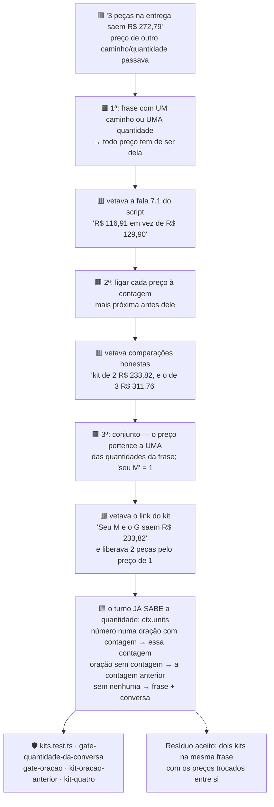

**Por que o conserto definitivo foi sair do texto:** três tentativas adivinhavam a
quantidade pelas palavras, e cada uma quebrou num formato novo. O turno determina a
quantidade de forma determinística (`quantityOf` + `leads.units`); o gate passou a
recebê-la em vez de inferir.

## 2. O preço de comparação ("em vez de R$ 129,90")

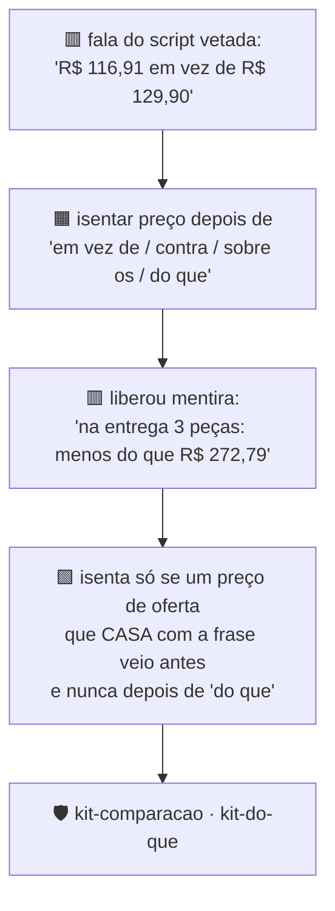

## 3. Qual caminho ela escolheu?

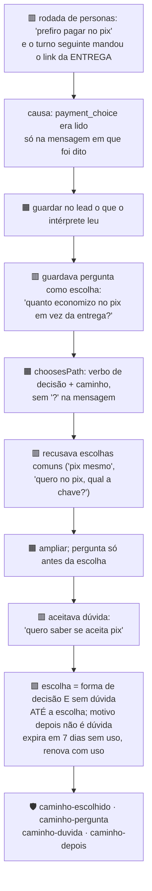

**Efeito colateral que o loop pegou:** guardar o caminho deixou conversas no antecipado
por mais tempo, e isso expôs o grafo 8 (prazo da entrega lido como prazo do antecipado).

## 4. Quando o kit é esquecido?

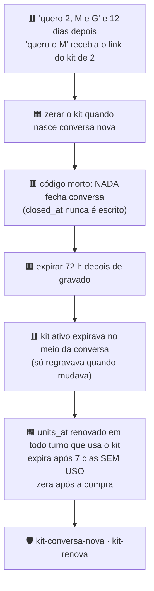

## 5. A nova tentativa (retry) duplica tamanhos?

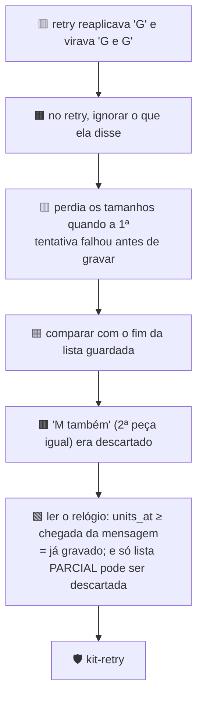

## 6. Pós-venda: quando passar para uma pessoa?

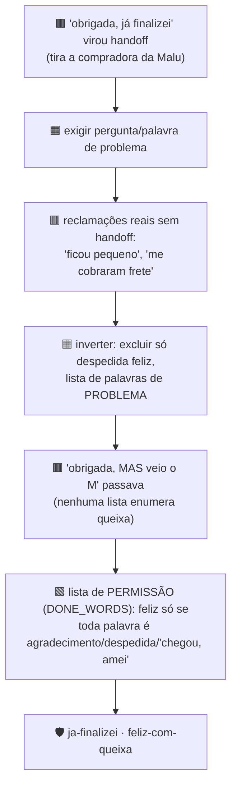

## 7. Despedida depois do link

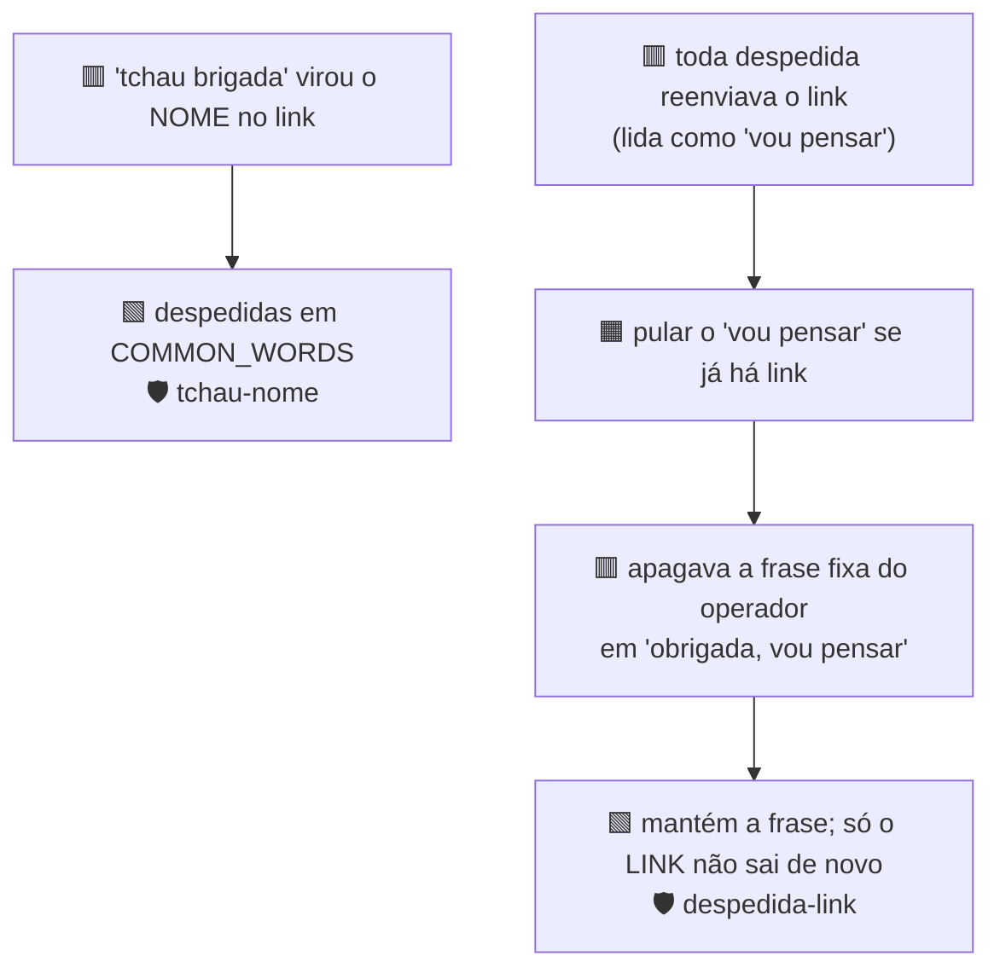

## 8. Prazo: de qual caminho é o número?

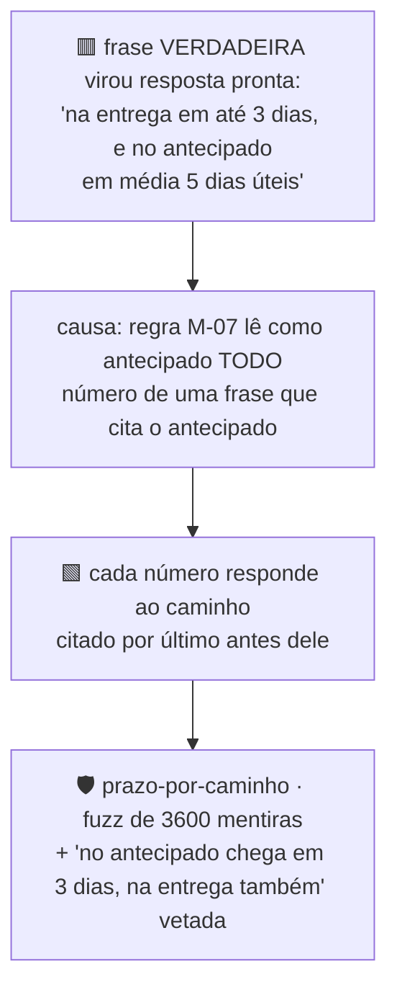

## 9. Peça grátis sem número

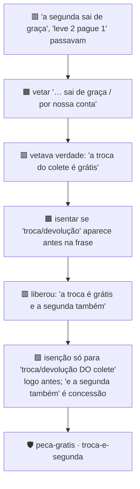

## 10. Régua pós-compra num kit

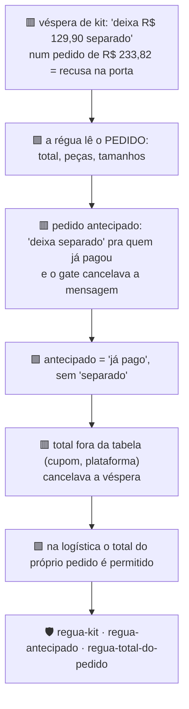

## 11. Checkout e integrações

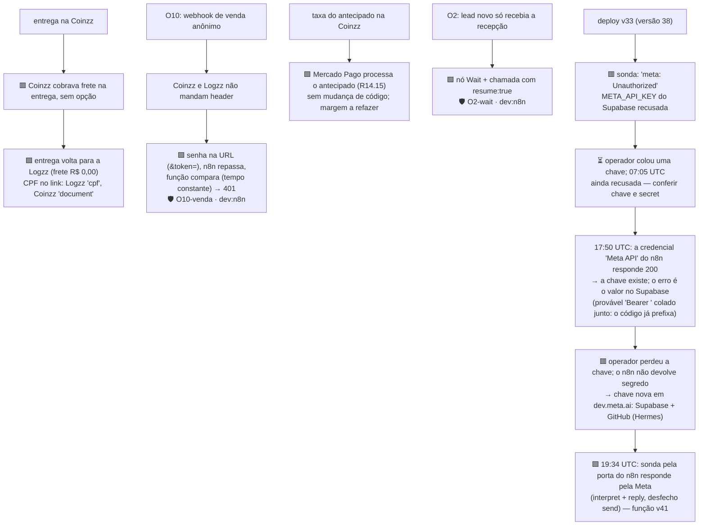

## 12. Quando o link sai? (H-2)

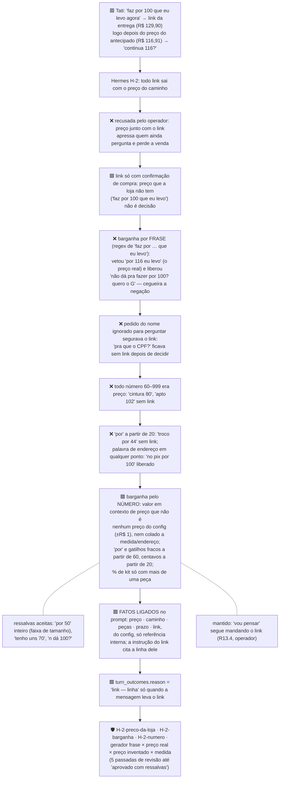

## 13. Ligar o WhatsApp sem abrir uma porta (R14.16)

```mermaid
flowchart TD
  S["Canal oficial precisa entrar antes do número existir"]
  G1["🟥 deliveryFor testado mas NÃO ligado à varredura:<br/>régua mandaria texto livre fora das 24h"]
  C1["🟩 varredura decide texto, template ou bloqueado (WA-1)"]
  R1["🟥 revisão: encorpa-inbound e a função turn são portas públicas<br/>(chave anon abre a função; o n8n repassava o corpo inteiro)"]
  C2["🟩 selo da entrada (HMAC) + lista fechada no n8n<br/>+ TURN_REQUIRE_SERVICE_ROLE"]
  R2["🟥 revisão: last_inbound_at gravado no fim do turno,<br/>na retomada e na nova tentativa: janela esticada"]
  C3["🟩 gravado uma vez, na mensagem dela, com o horário da Meta;<br/>janela fecha 10 min antes"]
  R3["🟥 revisão: mensagem perdida depois do 200 sem rastro;<br/>toque bloqueado cancelado em silêncio"]
  C4["🟩 envio em paralelo com log por id; e-mail dos toques bloqueados"]
  R4["🟥 2ª revisão: n8n enviava pelo campo channel, que o chamador escreve;<br/>recibo de leitura disparava em qualquer POST; 401 de selo virava e-mail"]
  C5["🟩 turno devolve sealed; n8n só envia com ele;<br/>recibo sai da função whatsapp (assinatura da Meta conferida)"]
  OFF["🟩 envio desligado (CANAL_ATIVO=false) até os valores do sócio"]
  GD["🛡️ WA-1-janela · WA-selo · WA-janela-no-fim · WA-envio-desligado · WA-canal-forjado ·<br/>regras n8n (corpo inteiro, channel, sealed) · teste do nó de envio contra src/channel"]
  S --> G1 --> C1 --> R1 --> C2 --> R2 --> C3 --> R3 --> C4 --> R4 --> C5 --> OFF --> GD
```

## 14. Margem do antecipado com o Mercado Pago (R14.15)

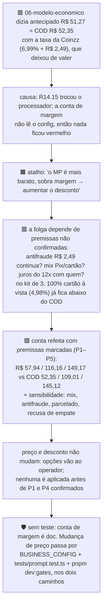

**Fechado em 2026-09-26:** P1 confirmado (antifraude não é cobrado) e o operador manteve
preços e descontos.

**Resíduo:** o número vale enquanto P4 (parcelado) não for confirmado
no painel do Mercado Pago/Coinzz. Trocou taxa, processador ou mix, refaça a tabela da caixa
de 2026-09-25 em [`06-modelo-economico.md`](../contexto-negocio/06-modelo-economico.md).

## 15. `perdido` sem dono (plano v2, 7.4)

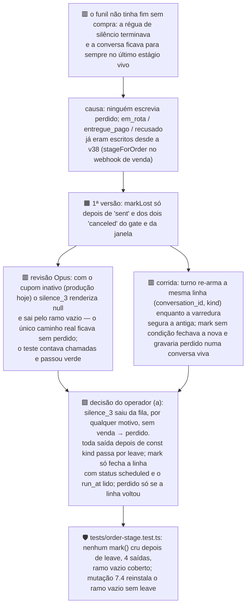

Ela volta sozinha: `furthest(perdido, x)` devolve o estágio que o próximo turno alcança.
Opt-out e handoff saem antes e não marcam; toque adiado não saiu da fila.

**Limites conhecidos:**
- **Venda que o webhook não casou** (`unknown_lead`, `ambiguous_phone`) deixa a régua viva.
  Três dias depois a conversa vira `perdido` sobre uma compra real. Isso se corrige sozinho
  se o webhook chegar depois (`furthest(perdido, pedido_criado)`).
- **Envio depois da resposta dela:** fechado em 2026-09-26, na segunda revisão. O toque só
  é gravado e enviado depois que a varredura fecha a linha. Se a cliente respondeu no
  intervalo, a linha já foi reagendada pelo turno dela e o toque velho não sai. A nova
  tentativa de turno segue a mesma regra. O custo é que o envio passa a ser no máximo uma
  vez: uma falha depois de fechar a linha perde um toque, em vez de enviar dois.
- **Sem conversa sintética:** não há conversa sintética de ponta a ponta; o teste lê a
  estrutura da varredura, que roda só no Deno.

## 16. Dois pedidos no mesmo lead

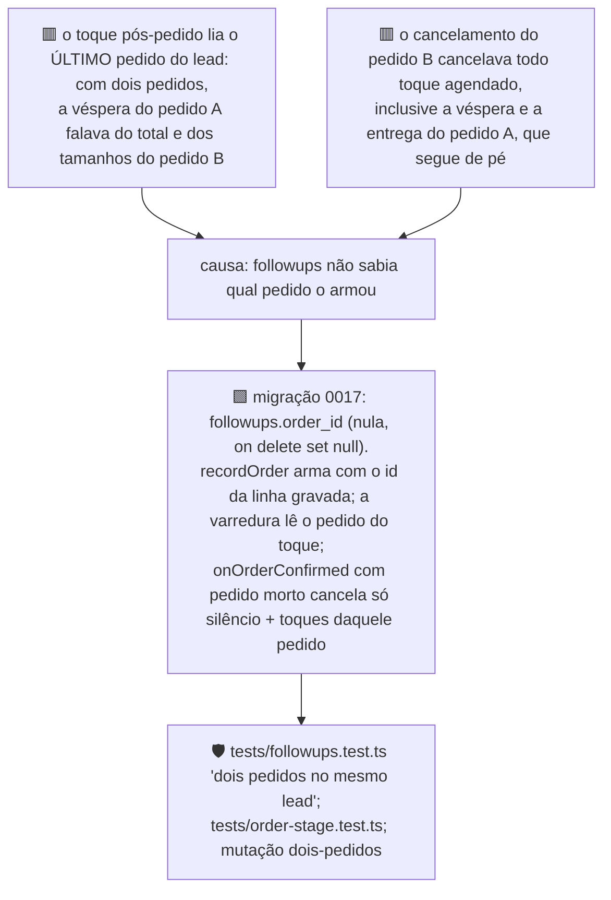

**Ordem de deploy:** aplicar a 0017 **antes** de publicar a `turn`. A varredura seleciona
`order_id`, e sem a coluna o PostgREST recusa a leitura: nenhum toque sai.

**Limites conhecidos:**
- **O segundo pedido não ganha régua própria**, porque `unique (conversation_id, kind)` já
  está ocupado pelos toques do primeiro. Mudar isso é mudar a chave da tabela, e fica fora
  deste passo.
- **Estágio por lead (revisão Opus, corrigido no mesmo dia):** o cancelamento do pedido B
  gravava `recusado`, que é terminal, enquanto o pedido A estava em rota. Quando A era
  entregue, a venda continuava contando como recusa. Agora `stageForLead` só grava
  `recusado` se nenhum outro pedido do lead estiver vivo. Continua em aberto o caso de
  ordem inversa: um pedido A recusado sozinho e, depois, um pedido B novo e entregue. A
  conversa fica em `recusado`, porque o estágio terminal não reabre.
  "Vivo" quer dizer "não morto" (`isOrderDead`). Um Pix expirado ou parado em "aguardando
  pagamento" conta como vivo e impede o `recusado` de outro pedido. O erro vai para o lado
  seguro: um estágio não terminal. Incluir `expir` em `isOrderDead` quando o vocabulário real
  das plataformas for conhecido.
- **Linha armada antes da 0017** tem `order_id` nulo e segue a regra antiga: lê o último
  pedido e morre com qualquer pedido cancelado.

## 17. O lembrete de 15 minutos depois do link nunca foi agendado (§R10.4)

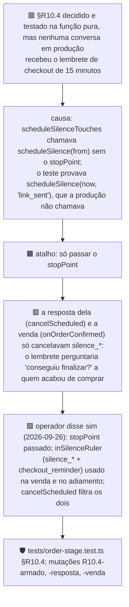

**Sexta revisão (NEEDS WORK, corrigida no mesmo dia):**
- **Lembrete duplicado:** com o link mandado às 23:40, o lembrete sai às 23:55. O
  `silence_1` era adiado para as 06:00 e reancorava a régua inteira, e o upsert reativava
  o lembrete que já tinha saído. Agora `rulerFor` só rearma o lembrete quando o toque
  adiado é o próprio lembrete, e o cancelamento do reancoramento não toca nele.
- **Lembrete de link que não saiu:** `stopPointOf` armava `link_sent` pela palavra
  "link" ou "checkout", que aparecem também em oferta e negação ("quer que eu te mande o
  link?"). Agora só conta se o texto leva um dos links de checkout, pela mesma função do
  M-03 (`linkSentRecently`), com os testes de negação. A sétima revisão pegou uma primeira
  versão com um segundo helper igual; a lista de links agora é montada uma vez só, em
  `CHECKOUT_BASES`.
- **Guardas:** mutações R10.4-duplicado e R10.4-palavra-link.

Achado pela revisão Opus de 2026-09-26 (terceira passada do §15), fora do diff que ela
revisava. **Lição:** um teste da função pura não prova que a produção chama a função com
esse argumento.

## 18. M-08: prazo do antecipado por extenso

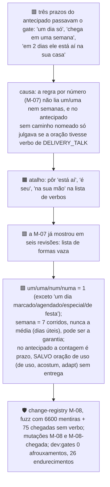

**Primeira revisão independente (NEEDS WORK, corrigida no mesmo dia):**
- **Faixa em semanas:** "1 a 2 semanas" escapava nos dois caminhos, porque o fim da faixa
  ia para uma checagem que só lia dias.
- **Âncora da garantia:** o backtracking em `(?:receb|cheg)\w*` derrotava o lookahead. Com
  isso, "tem uma semana pra trocar depois que chega em uma semana" era isentada como
  garantia.
- **Isenção de uso:** valia para a oração inteira, e "em 3 dias ele está aí pra você se
  adaptar" passava. Agora só isenta quando o uso governa a contagem.
- **Arrependimento:** "7 dias pra desistir, a contar do dia que receber" era vetada, e
  agora passa.
- **Guardas:** cada família tem gerador de fuzz, e há as mutações M-08-semanas, -ancora e
  -uso. Contra o `main`, 0 afrouxamentos.

**Segunda revisão (NEEDS WORK, corrigida no mesmo dia):**
- **Âncora com enchimento:** a âncora nova "a contar do dia que" e o `desist` abriram
  "tem 7 dias pra desistir quando chegar aí em 7 dias". O lookahead só protegia a contagem
  colada no verbo. Agora a âncora não sai quando o verbo dela tem uma contagem na mesma
  oração.
- **Troca ao lado de chegada sem verbo:** "pode trocar: em 7 dias ele está aí" passava
  (desde a M-07), e o "que é quando ele chega" era apagado como âncora. Agora os dois são
  barrados.
- **Guardas:** mutações M-08-enchimento, -troca-chegada e -que-e-quando. A M-08-ancora foi
  reescrita, porque a versão antiga deixou de reinstalar o bug.
- **Aceito em `gate-loosen-accepted.txt`:** "No pix você tem 7 dias pra desistir, a contar
  do dia que receber." É a frase honesta do arrependimento (CDC), e a base a vetava.

**Terceira revisão (NEEDS WORK, sem afrouxamento):** os consertos da segunda tinham sido
de sintoma, por lista de preposições, e os irmãos passavam: "em uns/cerca de/no prazo de 7
dias", "e em 7 dias ele está aí", "7 dias, bem quando ele chega". Agora a correção é pela
oração:
- **Contagem e âncora:** uma contagem na mesma oração do verbo da âncora é complemento
  dele, e a âncora fica. O único corte é "(você) tem/terá/são/é" logo antes da contagem.
- **Oração nova:** uma conjunção colada à contagem abre oração nova, e aí a troca não
  isenta mais.
- **Âncora depois da contagem:** só é retirada se estiver colada à contagem.
- **Dois-pontos:** ":" não abre oração quando vem seguido de "você tem".
- **Guardas:** 11 mutações da M-08.

**Quarta revisão (NEEDS WORK, sem afrouxamento) → ônus invertido:** depois de quatro
rodadas fechando formas enquanto os irmãos seguiam abertos, veio a mentira mais grave com o
pix nomeado: "o prazo até quando chegar é de 7 dias". O desenho foi invertido. A contagem
da garantia só é isenta quando uma forma de garantia a governa **positivamente**:
- **Propósito colado:** "7 dias pra trocar".
- **Palavra de troca tomando a contagem:** "a troca é em 7 dias", "pode trocar em até 7
  dias".
- **Depois da contagem, só o permitido:** "corridos/úteis", o propósito, uma âncora de
  início ou uma oração que não fala de chegada.

Saíram oito regexes (`anchor`, `anchorAfter`, `glued`, `newClause`…) e mais quatro variáveis
de apoio. **Lição:** numa isenção, liste o que prova a exceção, não o que a desmente.

**Quinta revisão (APROVADO COM RESSALVAS):** nenhuma mentira de chegada passa. As ressalvas
eram falsos positivos em frases honestas, e foram corrigidas no mesmo dia:
- **Falas do roteiro:** a fala para a objeção do antecipado ("7 dias pra trocar ou devolver
  contando do dia que receber", `02-script-do-agente.md:252`) era vetada. Agora passa.
- **Troca de tamanho:** "7 dias pra trocar de tamanho" era vetada. Agora passa.
- **Chegada por extenso:** "e ele está com você" e "o colete é seu" passaram a ser julgadas
  como chegada.
- **Aceitos:** as quatro frases do roteiro e da base que a base vetava.
- **Risco aceito:** depois de ";" só verbo de entrega e presença são julgados. É isso que
  deixa passar a frase inteira do roteiro, e "Pode trocar em 7 dias; que é o tempo da
  viagem." também passaria.

**Sexta revisão (NEEDS WORK, com afrouxamento real):** os dois caminhos novos da quinta
abriram brechas. O caso "são/o prazo é de N depois que recebermos" isentava prazo sem
palavra de troca: "No pix, são 7 dias depois que recebermos" passava nos dois caminhos. E o
texto depois de ";" não era julgado, então "No pix você tem 7 dias pra trocar; a entrega
também." passava. Os consertos:
- **Isenção sem troca:** só vale com "você tem/terá" e com ela recebendo
  (`receb(er|e|eu|a)`).
- **Depois de ";":** é julgado como o resto da frase. Só sai a locução do roteiro "do
  pedido até a entrega".
- **Guardas:** geradores de fuzz para os dois caminhos e mutações M-08-recebermos e
  M-08-ponto-e-virgula.
- **Aceito:** a fala inteira do roteiro (`:252`).
- **Fora da M-08, família da M-10:** "Pagou no pix? São 7 dias…" passa no caminho da
  entrega, porque o nome do caminho está na frase anterior.

**Sétima revisão (NEEDS WORK, com afrouxamento real):** a locução do roteiro "do pedido até
a entrega" era retirada em qualquer lugar, e com isso "No pix, você tem 7 dias pra trocar do
pedido até a entrega" passava nos dois caminhos. Os consertos:
- **Locução:** agora só sai com o sujeito do roteiro ("eu fico aqui… com você do pedido até
  a entrega").
- **"Prazo":** "o prazo pra trocar é de 7 dias" voltou a passar.
- **Presença:** "tá aqui com você" passou a ser vetada.
- **Guardas:** mutações M-08-locucao e M-08-prazo-de-troca. Ao todo, 16 mutações na M-08.

**Oitava revisão (NEEDS WORK, um achado):** tirar o `!prazo` fez "a troca é fácil, e o
prazo é 7 dias" voltar a passar, porque uma troca solta em outra oração tomava a contagem.
Os consertos:
- **Troca governando:** agora a troca só toma a contagem quando a governa ("o prazo pra
  trocar é de", "pra trocar, o prazo é de", "é só trocar: você tem").
- **Cópula:** o substantivo aceita no máximo uma cópula, então "garantia e são" não vira
  mais "garantia é são".
- **Guardas:** um gerador com 1568 mentiras e as mutações M-08-troca-solta e M-08-copula.

**Nona revisão → APROVADO COM RESSALVAS:** num corpus acumulado de 612 frases das nove
rodadas, rodado no `main` e no branch nos dois caminhos, sobrou uma família só: "se precisar
receber e trocar, são 7 dias". Ali o "se" atravessava a chegada. Foi corrigida com um gerador
e a mutação M-08-se-chegada.

Ressalvas aceitas:
- **Garantia como condição:** "se quiser garantia, são 7 dias" já passava no `main`.
- **Frase ambígua:** "o prazo com garantia de troca é de 7 dias".
- **Nome na frase anterior:** "Pagou no pix? São 7 dias…" passa no caminho da entrega. É a
  família da M-10.
- **Dois falsos positivos baratos no antecipado.**

**Lição das nove rodadas:** cada exceção aberta para uma frase honesta foi a porta da mentira
seguinte. O que convergiu foi governo positivo, verificado por um corpus acumulado de
mentiras rodado contra o `main` a cada passada.

**Custo aceito:** no antecipado, uma contagem sem caminho nomeado e fora de uma oração de
uso agora é julgada. "Sua festa é daqui a uma semana" é vetada e custa uma reescrita,
nunca uma mentira. Das frases do corpus que passaram a ser vetadas, a maioria já é barrada
por outro gate. As exceções são falsos positivos baratos, como "já faz 10 dias" na fala da
cliente.

## 19. M-10: prazo da entrega por extenso, e o caminho nomeado na frase anterior

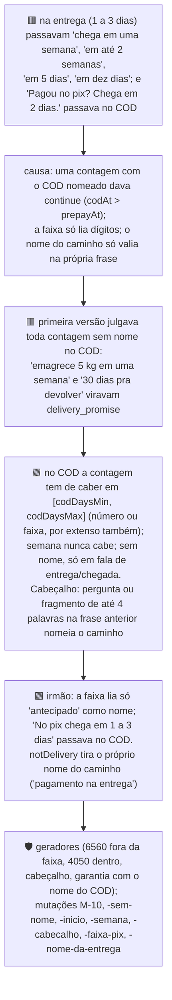

**Custo aceito:** falsos positivos baratos que custam uma reescrita cada. O mais provável é
"…7 dias pra trocar e suporte todo dia", porque a cauda da garantia recusa "dia".

**Revisão independente: APROVADO COM RESSALVAS.** Nenhuma mentira que o `main` vete passa no
branch. A negação no cabeçalho ("Sem pix, chega em 1 a 3 dias" vetada; "Nada de pix. Chega em
5 dias, depende da região" passando) foi corrigida em seguida.

A correção:
- **Negadores:** `prepaidNamed` ignora o nome do antecipado quando ele vem negado ("sem",
  "nada de", "não precisa", "não quer" fora de pergunta, "pix não!").
- **Onde vale:** no cabeçalho, na faixa e na regra de número.
- **Sombreamento:** o `PREPAY_NAME` local da faixa sombreava o externo, e com isso "Te mando
  o link e chega em 1 a 3 dias" era vetada. Foi consertado.
- **Guardas:** gerador com 802 frases e 5 mutações novas. Esta correção **não teve revisão
  independente**.

**Fora do conserto, já existiam antes e ficam registrados:**
- **Nome do COD depois da contagem:** "Chega em uma semana na entrega." passa no
  antecipado.
- **Cabeçalho COD com corpo de média:** "Na entrega? Varia, em média 5 dias úteis." passa.
- **"Entregador" ou "na porta" como nome do COD em frase do antecipado:** "No pix, o
  entregador leva em 2 dias." vai para a faixa de 1 a 3 dias.
- **Contagens fora da regra:** "um mês", "quinzena", "meia semana", "de zero a três dias",
  "às vezes cinco", "nunca passa de 5 dias", e "5 dias." sozinho.
- **Duas frases de caminho:** "Na entrega ou no pix, chega em 1 a 3 dias." passa no COD.

**Custo aceito, falsos positivos baratos no COD:** o `ARRIVAL` inclui "aí" (a muleta da
Malu) e casa "saia" em `sai\w*`. "E aí, em 2 semanas você já se acostuma" e "A garantia é de
7 dias pagando na porta" são vetadas.

**Instável, causa provável achada na revisão final de 2026-09-27:** `pnpm verificar:guardas`
deu 100, 101 e 102 de 102 no mesmo HEAD. A ferramenta lia a lista de mutações do arquivo da
árvore, mas aplicava cada mutação num worktree do commit. Com edição não commitada, as duas
versões divergiam. Além disso, uma guarda morta por timeout contava como "pegou".

A ferramenta agora:
- lê o HEAD uma vez só;
- recusa rodar com a árvore suja;
- trata guarda sem status como inconclusiva.

**Registro:** as mutações M-08-tomada e M-08-troca-solta tinham ficado com o texto de antes
da nona revisão, e foram atualizadas neste commit. Toda mudança numa linha âncora de mutação
tem de rodar `pnpm verificar:guardas` inteiro, não só a mutação nova.

## 20. Revisão final do branch (2026-09-27)

Quatro revisores Opus em paralelo (correção, integração, segurança, testes) sobre
`main...claude/focused-gates-fjpixt`.

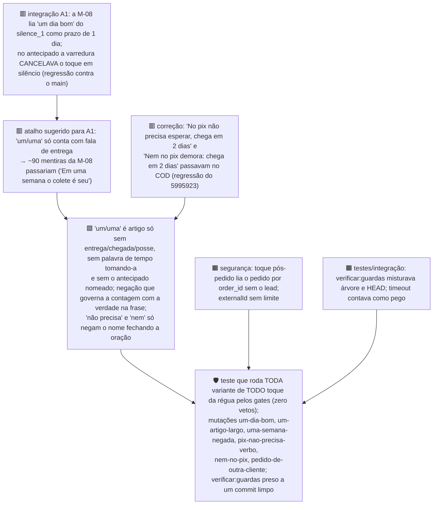

**Provado na PostgREST real, com leituras apenas:** `or=(kind.like.silence_*,kind.eq.checkout_reminder)`
casa, e a igualdade no timestamp que a própria API devolve (`…403606+00:00`) casa em `eq.`. Com
isso, o fechamento pela `run_at` e o cancelamento na resposta funcionam no banco de verdade.

**Aviso ao operador (corrigido em 2026-09-28):** o `perdido` não acontece de uma vez no
deploy. Produção tem 0 linhas em `followups`, e a v41 já cancela os `silence_3` vencidos. Com o
cupom inativo o `silence_3` sai cancelado, e isso é o fim da régua (opção a), um lead de cada vez.

**Resíduos:**
- **Mentira que passa no COD sem caminho nomeado:** "Uma semana e ele tá contigo". O `main`
  também deixava passar.
- **Negação só por extenso:** a negação que governa a contagem vale só para "um/uma".
- **Envio no máximo uma vez:** com o canal ligado, uma falha da Cloud API perde o toque. Fica
  só o e-mail de falha.
- **Testes só textuais:** vários testes de `index.ts` só leem o texto do arquivo. A prova de
  produção é a sonda da varredura pela porta do n8n depois do deploy.
- **Conferência final (APROVADO COM RESSALVAS):** a exceção do artigo deixa passar no
  antecipado mentiras de "uma semana" que o 5995923 vetava. O `main` também as deixava
  passar, então não é regressão. Os casos:
  - "Uma semana, no máximo." — o teste da cauda não aceita a vírgula; `^[\s,]+` resolve.
  - "Numa semana você já está com ele." — falta "com ele / o colete" na lista de posse.
  - "Daqui (a) uma semana você já está usando." — falta "daqui (a)" nas palavras de tempo
    antes da contagem.
  - "Numa semana você já veste." — chegada disfarçada de uso.

  A gravidade é baixa: uma semana corrida fica perto da média de 5 dias úteis. É o próximo
  item de gate.

---

## Lições (valem para qualquer correção futura)

1. **Toda isenção num gate é um afrouxamento.** Antes de isentar, escreva a mentira que a
   isenção libera e prove que ela continua vetada (grafos 2 e 9 erraram aqui).
2. **Exclua, nunca exija.** "Só passa para uma pessoa se perguntar" perdeu reclamações; "passa,
   exceto despedida feliz" não perde (grafo 6).
3. **Para o caminho feliz, lista de permissão; nunca lista de proibição.** Nenhuma lista
   enumera todas as queixas; uma lista enumera as despedidas (grafo 6).
4. **Estado vem do turno, não do texto.** Três heurísticas de quantidade falharam; passar
   `ctx.units` ao gate resolveu (grafo 1).
5. **Estado guardado precisa de dono do tempo**: quando nasce, quando renova, quando expira
   e quando zera. "Zera na conversa nova" era código morto (grafo 4).
6. **Uma correção muda o contexto de outra.** Guardar o caminho expôs um veto antigo no
   prazo (grafos 3 → 8). Depois de corrigir, rode a rodada de personas de novo.
7. **A correção também é revisada.** Nove passadas de revisão: cada uma achou furos nas
   correções da anterior. Parar só em "aprovado com resíduos" listados.
8. **Teste local não prova credencial de produção.** O proxy desta máquina injetava a chave
   da Meta; produção tinha outra. Toda subida termina com sonda pela porta do n8n (grafo 11).
9. **Mutação escrita por script:** o `re.sub` do Python come as barras invertidas do texto
   de substituição; use uma função como substituto, ou a mutação "não se aplica" e escapa.
