# Grafo de decisões — kits, checkout e o loop de verificação (2026-09-25)

Para não repetir erro: cada problema do dia, o caminho que **não** funcionou e por quê, a
correção que ficou e a guarda que impede a volta. Decisões de negócio em
[`03-decisoes-tomadas.md` §Rodada 14](03-decisoes-tomadas.md); detalhe técnico em
[`registro.md` M-09](../../agente-ia/08-mudancas/registro.md). Cada "guarda" é um teste e
uma mutação em `pnpm verificar:guardas` (o bug reinstalado tem de deixar o teste vermelho).

Legenda: 🟥 sintoma · 🟧 tentativa que falhou · 🟩 correção que ficou · 🛡️ guarda.

## Como ler antes de mexer

1. Vai mexer num **gate de preço ou prazo**? Leia os grafos 1, 2 e 8 — todos os atalhos
   óbvios já foram tentados e abriram mentira ou vetaram frase honesta.
2. Vai mexer em **estado da conversa** (kit, caminho, retry)? Grafos 3, 4 e 5.
3. Vai mexer em **handoff, despedida ou pós-venda**? Grafos 6 e 7.
4. As **lições** no fim valem para qualquer heurística de texto.

---

## 1. De quantas peças fala um preço?

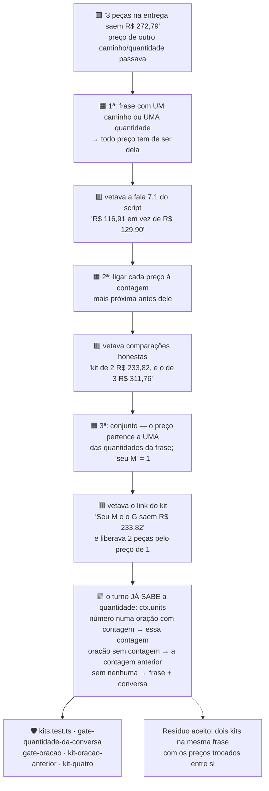

**Por que o conserto definitivo foi sair do texto:** três tentativas adivinhavam a
quantidade pelas palavras, e cada uma quebrou num formato novo. O turno determina a
quantidade de forma determinística (`quantityOf` + `leads.units`); o gate passou a
recebê-la em vez de inferir.

## 2. O preço de comparação ("em vez de R$ 129,90")

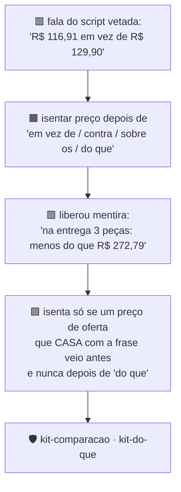

## 3. Qual caminho ela escolheu?

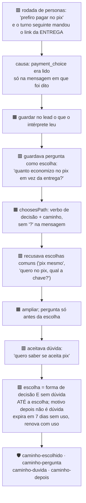

**Efeito colateral que o loop pegou:** guardar o caminho deixou conversas no antecipado
por mais tempo, e isso expôs o grafo 8 (prazo da entrega lido como prazo do antecipado).

## 4. Quando o kit é esquecido?

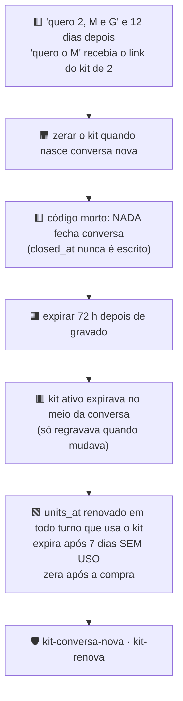

## 5. A nova tentativa (retry) duplica tamanhos?

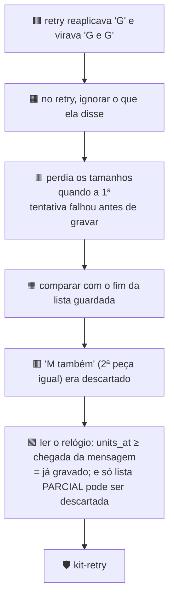

## 6. Pós-venda: quando passar para uma pessoa?

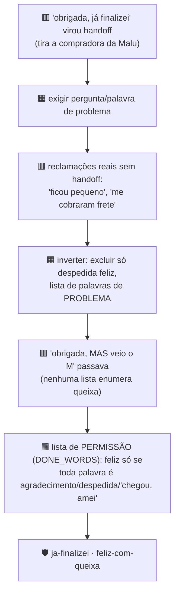

## 7. Despedida depois do link

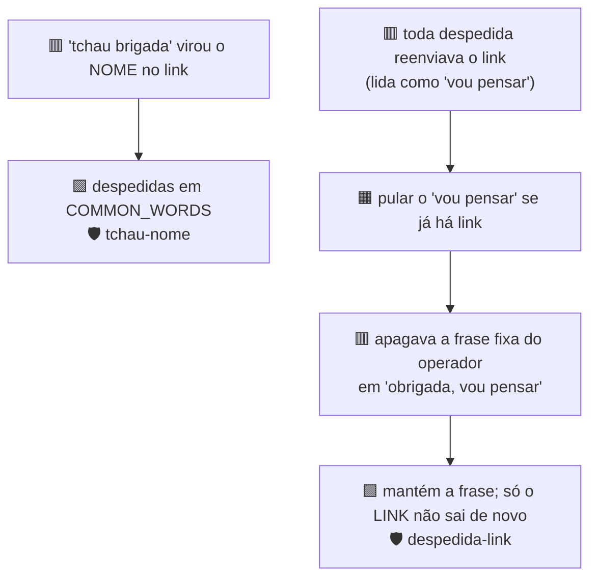

## 8. Prazo: de qual caminho é o número?

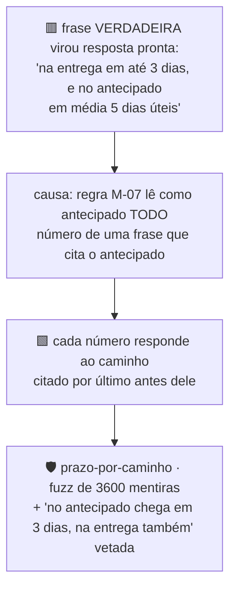

## 9. Peça grátis sem número

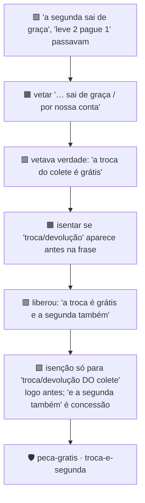

## 10. Régua pós-compra num kit

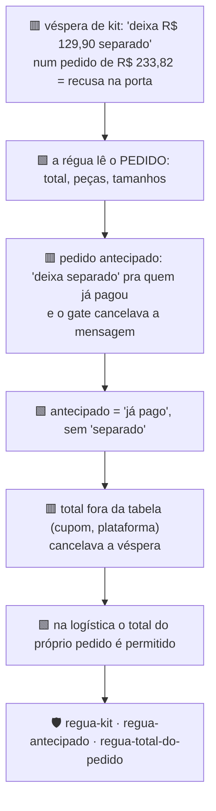

## 11. Checkout e integrações

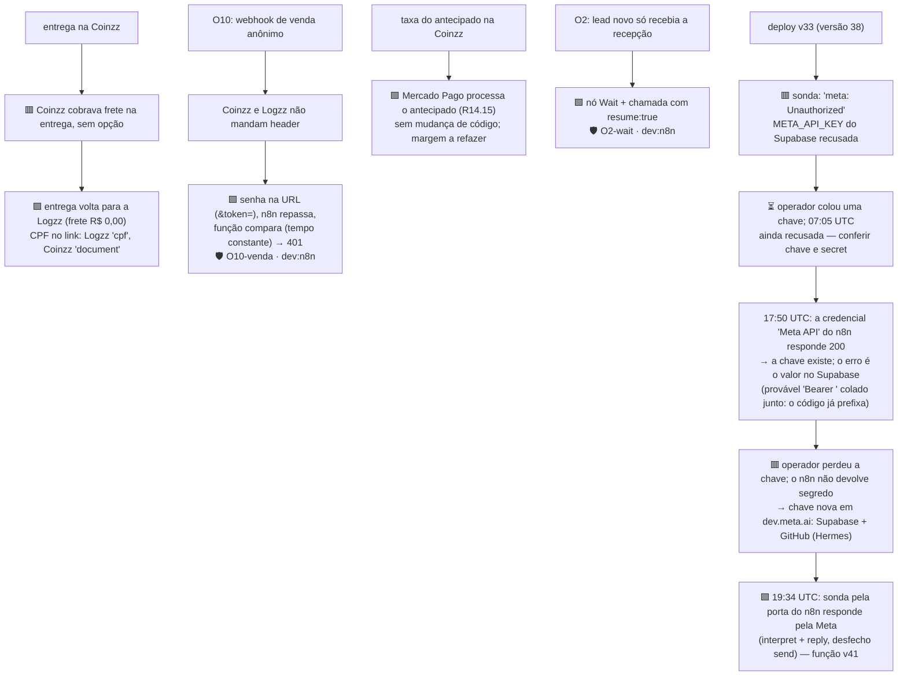

## 12. Quando o link sai? (H-2)

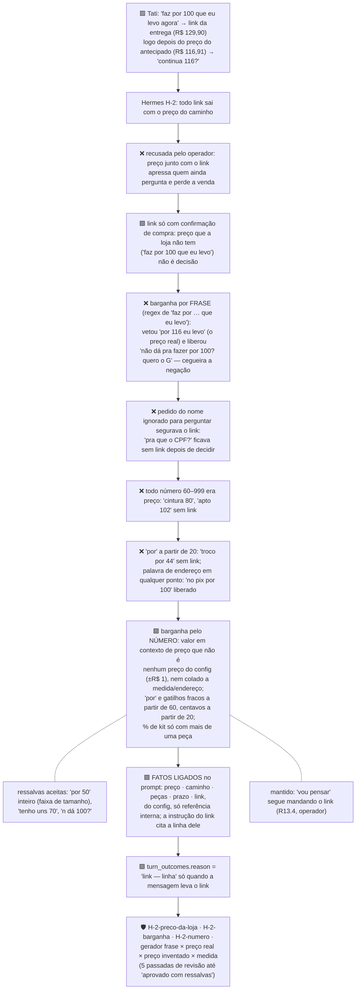

## 13. Ligar o WhatsApp sem abrir uma porta (R14.16)

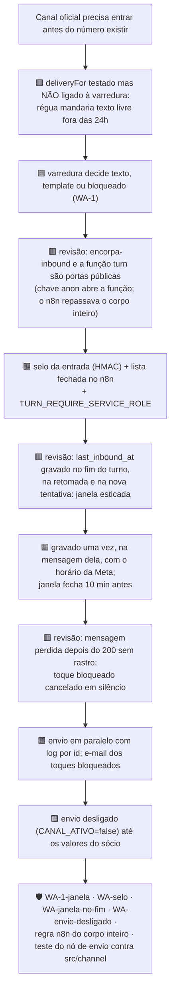

---

## Lições (valem para qualquer correção futura)

1. **Toda isenção num gate é um afrouxamento.** Antes de isentar, escreva a mentira que a
   isenção libera e prove que ela continua vetada (grafos 2 e 9 erraram aqui).
2. **Exclua, nunca exija.** "Só passa para uma pessoa se perguntar" perdeu reclamações; "passa,
   exceto despedida feliz" não perde (grafo 6).
3. **Para o caminho feliz, lista de permissão; nunca lista de proibição.** Nenhuma lista
   enumera todas as queixas; uma lista enumera as despedidas (grafo 6).
4. **Estado vem do turno, não do texto.** Três heurísticas de quantidade falharam; passar
   `ctx.units` ao gate resolveu (grafo 1).
5. **Estado guardado precisa de dono do tempo**: quando nasce, quando renova, quando expira
   e quando zera. "Zera na conversa nova" era código morto (grafo 4).
6. **Uma correção muda o contexto de outra.** Guardar o caminho expôs um veto antigo no
   prazo (grafos 3 → 8). Depois de corrigir, rode a rodada de personas de novo.
7. **A correção também é revisada.** Nove passadas de revisão: cada uma achou furos nas
   correções da anterior. Parar só em "aprovado com resíduos" listados.
8. **Teste local não prova credencial de produção.** O proxy desta máquina injetava a chave
   da Meta; produção tinha outra. Toda subida termina com sonda pela porta do n8n (grafo 11).
9. **Mutação escrita por script:** o `re.sub` do Python come as barras invertidas do texto
   de substituição; use uma função como substituto, ou a mutação "não se aplica" e escapa.
